# FairQueue Architecture Documentation

## Table of Contents
1. [Overview](#overview)
2. [System Architecture](#system-architecture)
3. [Core Components](#core-components)
4. [Data Flow](#data-flow)
5. [Priority System](#priority-system)
6. [Work Stealing Strategy](#work-stealing-strategy)
7. [Configuration Management](#configuration-management)
8. [Implementation Patterns](#implementation-patterns)
9. [Performance Considerations](#performance-considerations)
10. [Scalability](#scalability)

## Overview

FairQueue is a production-ready fair queue implementation using Redis with work stealing and priority scheduling. The system is designed to provide fair task distribution across multiple users while maintaining high performance and reliability.

### Key Features
- **Fair Scheduling**: Round-robin user selection with work stealing capability
- **Priority Queues**: Type-safe priority system (1-6) with critical/normal separation
- **Atomic Operations**: Lua scripts ensure consistency and performance
- **Configuration-Based**: No Redis state for user management, fully configurable
- **Dual Implementation**: Both synchronous and asynchronous versions
- **Production Ready**: Error handling, graceful shutdown, health checks

## System Architecture

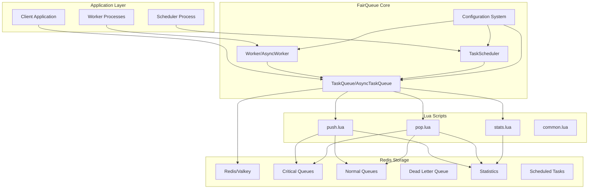
```mermaid
graph TB
    subgraph "Application Layer"
        A[Client Application]
        W[Worker Processes]
        S[Scheduler Process]
    end
    
    subgraph "FairQueue Core"
        TQ[TaskQueue/AsyncTaskQueue]
        WR[Worker/AsyncWorker]
        SC[TaskScheduler]
        CFG[Configuration System]
    end
    
    subgraph "Redis Storage"
        R[Redis/Valkey]
        CQ[Critical Queues]
        NQ[Normal Queues]
        DLQ[Dead Letter Queue]
        ST[Statistics]
        SCH[Scheduled Tasks]
    end
    
    subgraph "Lua Scripts"
        PS[push.lua]
        POP[pop.lua]
        STATS[stats.lua]
        COMMON[common.lua]
    end
    
    A --> TQ
    W --> WR
    S --> SC
    TQ --> R
    WR --> TQ
    SC --> TQ
    
    TQ --> PS
    TQ --> POP
    TQ --> STATS
    
    PS --> CQ
    PS --> NQ
    PS --> ST
    POP --> CQ
    POP --> NQ
    POP --> ST
    STATS --> ST
    
    CFG --> TQ
    CFG --> WR
    CFG --> SC
```

## Core Components

### 1. Task Queue (`TaskQueue`/`AsyncTaskQueue`)

The central component that manages task storage and retrieval operations.

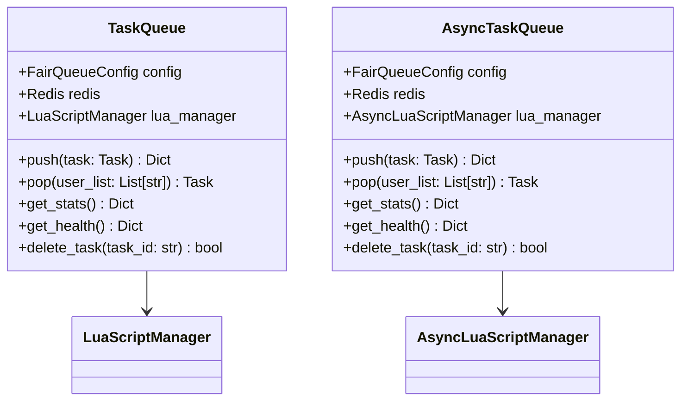
```mermaid
classDiagram
    class TaskQueue {
        +FairQueueConfig config
        +Redis redis
        +LuaScriptManager lua_manager
        +push(task: Task) Dict
        +pop(user_list: List[str]) Task
        +get_stats() Dict
        +get_health() Dict
        +delete_task(task_id: str) bool
    }
    
    class AsyncTaskQueue {
        +FairQueueConfig config
        +Redis redis
        +AsyncLuaScriptManager lua_manager
        +push(task: Task) Dict
        +pop(user_list: List[str]) Task
        +get_stats() Dict
        +get_health() Dict
        +delete_task(task_id: str) bool
    }
    
    TaskQueue --> LuaScriptManager
    AsyncTaskQueue --> AsyncLuaScriptManager
```

### 2. Worker System (`Worker`/`AsyncWorker`)

Processes tasks with work stealing capability.

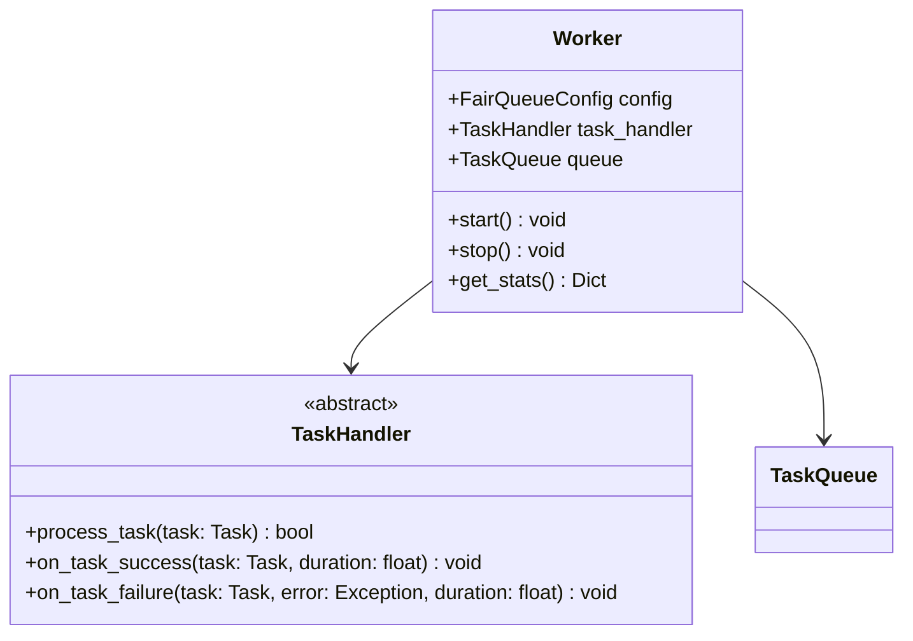
```mermaid
classDiagram
    class Worker {
        +FairQueueConfig config
        +TaskHandler task_handler
        +TaskQueue queue
        +start() void
        +stop() void
        +get_stats() Dict
    }
    
    class TaskHandler {
        <<abstract>>
        +process_task(task: Task) bool
        +on_task_success(task: Task, duration: float) void
        +on_task_failure(task: Task, error: Exception, duration: float) void
    }
    
    Worker --> TaskHandler
    Worker --> TaskQueue
```

### 3. Task Scheduler (`TaskScheduler`)

Manages cron-based task scheduling with distributed locking.

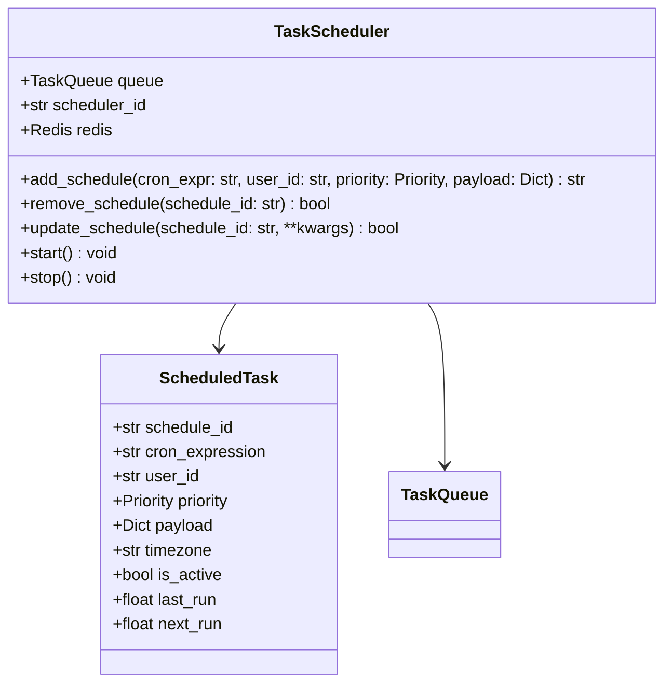
```mermaid
classDiagram
    class TaskScheduler {
        +TaskQueue queue
        +str scheduler_id
        +Redis redis
        +add_schedule(cron_expr: str, user_id: str, priority: Priority, payload: Dict) str
        +remove_schedule(schedule_id: str) bool
        +update_schedule(schedule_id: str, **kwargs) bool
        +start() void
        +stop() void
    }
    
    class ScheduledTask {
        +str schedule_id
        +str cron_expression
        +str user_id
        +Priority priority
        +Dict payload
        +str timezone
        +bool is_active
        +float last_run
        +float next_run
    }
    
    TaskScheduler --> ScheduledTask
    TaskScheduler --> TaskQueue
```

### 4. Configuration System

Unified configuration management for all components.

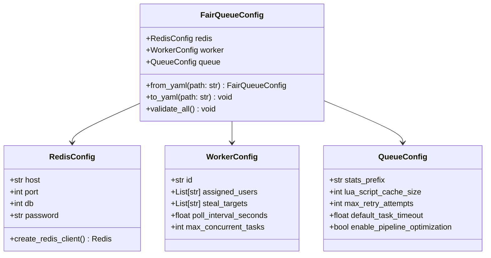
```mermaid
classDiagram
    class FairQueueConfig {
        +RedisConfig redis
        +WorkerConfig worker
        +QueueConfig queue
        +from_yaml(path: str) FairQueueConfig
        +to_yaml(path: str) void
        +validate_all() void
    }
    
    class RedisConfig {
        +str host
        +int port
        +int db
        +str password
        +create_redis_client() Redis
    }
    
    class WorkerConfig {
        +str id
        +List[str] assigned_users
        +List[str] steal_targets
        +float poll_interval_seconds
        +int max_concurrent_tasks
    }
    
    class QueueConfig {
        +str stats_prefix
        +int lua_script_cache_size
        +int max_retry_attempts
        +float default_task_timeout
        +bool enable_pipeline_optimization
    }
    
    FairQueueConfig --> RedisConfig
    FairQueueConfig --> WorkerConfig
    FairQueueConfig --> QueueConfig
```

## Data Flow

### Task Submission Flow

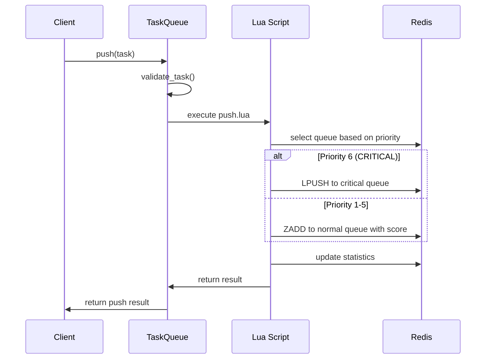
```mermaid
sequenceDiagram
    participant C as Client
    participant TQ as TaskQueue
    participant L as Lua Script
    participant R as Redis
    
    C->>TQ: push(task)
    TQ->>TQ: validate_task()
    TQ->>L: execute push.lua
    L->>R: select queue based on priority
    alt Priority 6 (CRITICAL)
        L->>R: LPUSH to critical queue
    else Priority 1-5
        L->>R: ZADD to normal queue with score
    end
    L->>R: update statistics
    L->>TQ: return result
    TQ->>C: return push result
```

### Task Processing Flow

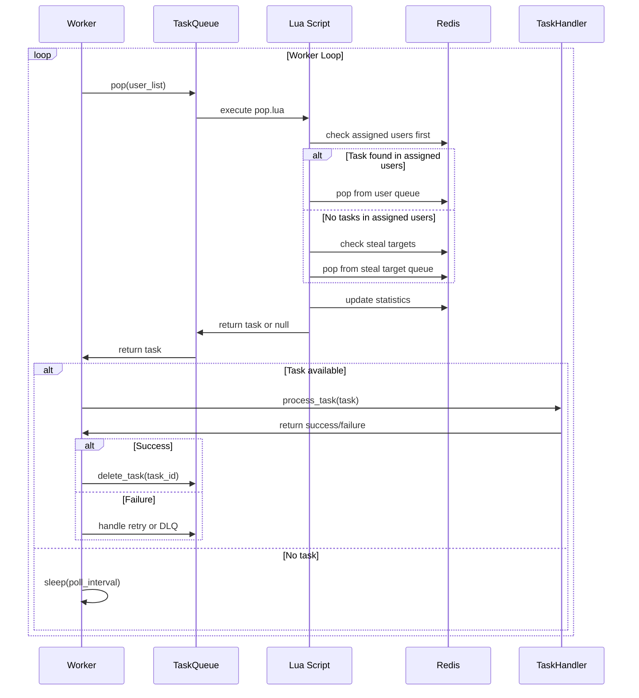
```mermaid
sequenceDiagram
    participant W as Worker
    participant TQ as TaskQueue
    participant L as Lua Script
    participant R as Redis
    participant TH as TaskHandler
    
    loop Worker Loop
        W->>TQ: pop(user_list)
        TQ->>L: execute pop.lua
        L->>R: check assigned users first
        alt Task found in assigned users
            L->>R: pop from user queue
        else No tasks in assigned users
            L->>R: check steal targets
            L->>R: pop from steal target queue
        end
        L->>R: update statistics
        L->>TQ: return task or null
        TQ->>W: return task
        
        alt Task available
            W->>TH: process_task(task)
            TH->>W: return success/failure
            alt Success
                W->>TQ: delete_task(task_id)
            else Failure
                W->>TQ: handle retry or DLQ
            end
        else No task
            W->>W: sleep(poll_interval)
        end
    end
```

## Priority System

FairQueue implements a sophisticated priority system with two queue types:

### Priority Levels

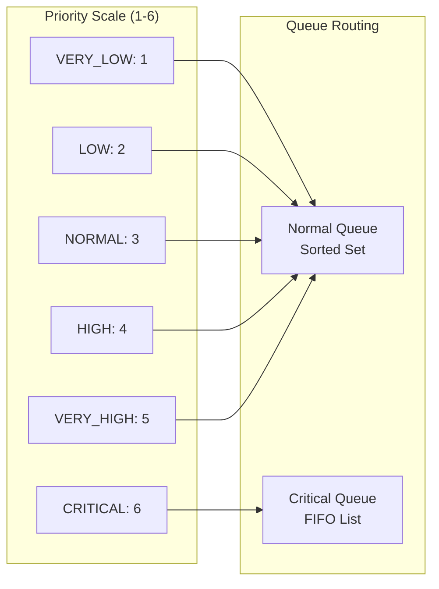
```mermaid
graph LR
    subgraph "Priority Scale (1-6)"
        P1[VERY_LOW: 1]
        P2[LOW: 2]
        P3[NORMAL: 3]
        P4[HIGH: 4]
        P5[VERY_HIGH: 5]
        P6[CRITICAL: 6]
    end
    
    subgraph "Queue Routing"
        P1 --> NQ[Normal Queue<br/>Sorted Set]
        P2 --> NQ
        P3 --> NQ
        P4 --> NQ
        P5 --> NQ
        P6 --> CQ[Critical Queue<br/>FIFO List]
    end
```

### Queue Structure

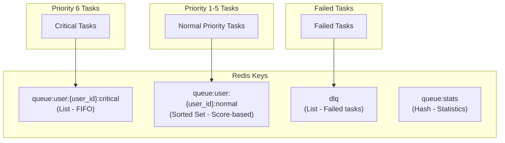
```mermaid
graph TB
    subgraph "Redis Keys"
        CQ["queue:user:{user_id}:critical<br/>(List - FIFO)"]
        NQ["queue:user:{user_id}:normal<br/>(Sorted Set - Score-based)"]
        DLQ["dlq<br/>(List - Failed tasks)"]
        ST["queue:stats<br/>(Hash - Statistics)"]
    end
    
    subgraph "Priority 6 Tasks"
        T6[Critical Tasks] --> CQ
    end
    
    subgraph "Priority 1-5 Tasks"
        T15[Normal Priority Tasks] --> NQ
    end
    
    subgraph "Failed Tasks"
        FT[Failed Tasks] --> DLQ
    end
```

### Scoring Algorithm for Normal Queue

For priority 1-5 tasks, the score is calculated as:

```
score = created_at + (priority_weight * elapsed_time)
priority_weight = priority / 5.0
elapsed_time = current_time - created_at
```

This ensures higher priority tasks and older tasks get processed first.

## Work Stealing Strategy

Workers implement a sophisticated work stealing strategy for load balancing:

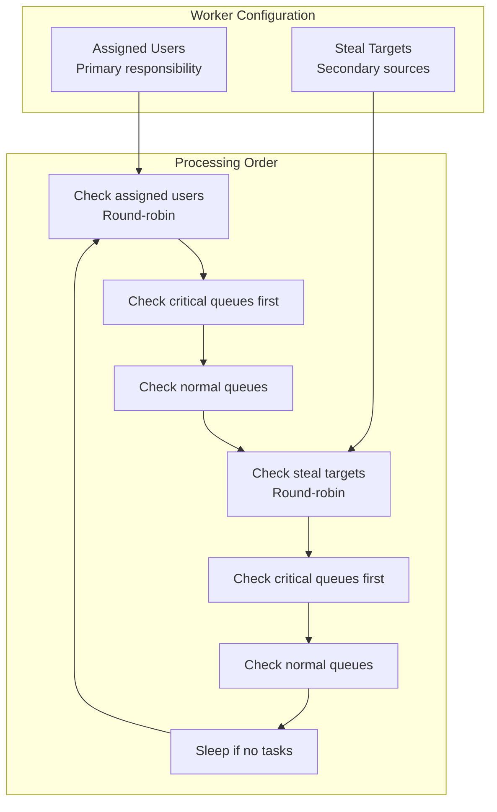
```mermaid
graph TD
    subgraph "Worker Configuration"
        AU[Assigned Users<br/>Primary responsibility]
        ST[Steal Targets<br/>Secondary sources]
    end
    
    subgraph "Processing Order"
        A1[Check assigned users<br/>Round-robin]
        A2[Check critical queues first]
        A3[Check normal queues]
        B1[Check steal targets<br/>Round-robin]
        B2[Check critical queues first]
        B3[Check normal queues]
        C[Sleep if no tasks]
    end
    
    AU --> A1
    A1 --> A2
    A2 --> A3
    A3 --> B1
    ST --> B1
    B1 --> B2
    B2 --> B3
    B3 --> C
    C --> A1
```

### Configuration Example

```yaml
worker:
  id: "worker-001"
  assigned_users: ["user:1", "user:3", "user:5"]  # Primary responsibility
  steal_targets: ["user:2", "user:4", "user:6"]   # Can steal from these
  poll_interval_seconds: 1.0
  max_concurrent_tasks: 10
```

## Configuration Management

### Unified Configuration Structure

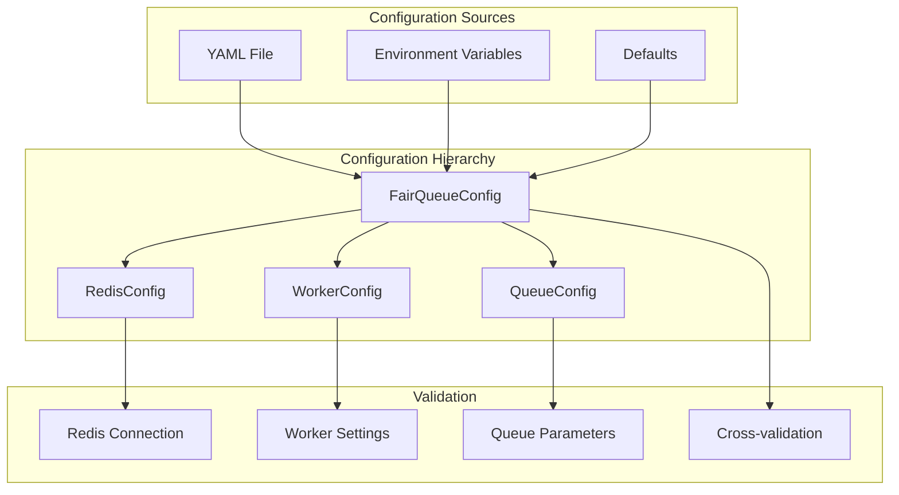
```mermaid
graph TB
    subgraph "Configuration Hierarchy"
        FC[FairQueueConfig]
        RC[RedisConfig]
        WC[WorkerConfig]
        QC[QueueConfig]
    end
    
    FC --> RC
    FC --> WC
    FC --> QC
    
    subgraph "Configuration Sources"
        YF[YAML File]
        ENV[Environment Variables]
        DEF[Defaults]
    end
    
    YF --> FC
    ENV --> FC
    DEF --> FC
    
    subgraph "Validation"
        V1[Redis Connection]
        V2[Worker Settings]
        V3[Queue Parameters]
        V4[Cross-validation]
    end
    
    RC --> V1
    WC --> V2
    QC --> V3
    FC --> V4
```

## Implementation Patterns

### 1. Lua Script Architecture

All critical operations are implemented as atomic Lua scripts:

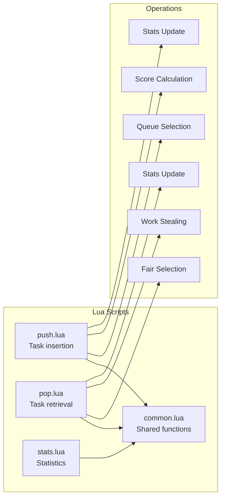
```mermaid
graph LR
    subgraph "Lua Scripts"
        CM[common.lua<br/>Shared functions]
        PS[push.lua<br/>Task insertion]
        PP[pop.lua<br/>Task retrieval]
        ST[stats.lua<br/>Statistics]
    end
    
    PS --> CM
    PP --> CM
    ST --> CM
    
    subgraph "Operations"
        PS --> QS[Queue Selection]
        PS --> SC[Score Calculation]
        PS --> SU[Stats Update]
        
        PP --> FS[Fair Selection]
        PP --> WS[Work Stealing]
        PP --> SU2[Stats Update]
    end
```

### 2. Error Handling Strategy

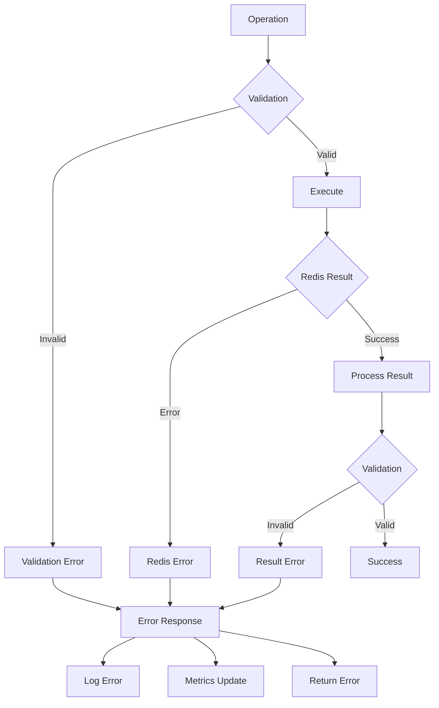
```mermaid
graph TD
    OP[Operation]
    OP --> V{Validation}
    V -->|Invalid| E1[Validation Error]
    V -->|Valid| EX[Execute]
    EX --> R{Redis Result}
    R -->|Error| E2[Redis Error]
    R -->|Success| PR[Process Result]
    PR --> V2{Validation}
    V2 -->|Invalid| E3[Result Error]
    V2 -->|Valid| S[Success]
    
    E1 --> ER[Error Response]
    E2 --> ER
    E3 --> ER
    
    ER --> L[Log Error]
    ER --> M[Metrics Update]
    ER --> RT[Return Error]
```

### 3. Dual Implementation Pattern

FairQueue provides both synchronous and asynchronous implementations:

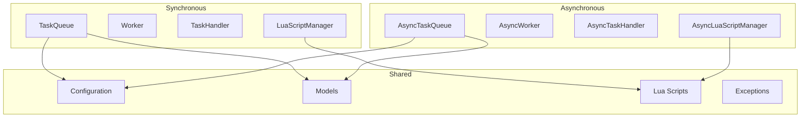
```mermaid
graph TB
    subgraph "Synchronous"
        TQ[TaskQueue]
        W[Worker]
        TH[TaskHandler]
        LSM[LuaScriptManager]
    end
    
    subgraph "Asynchronous"
        ATQ[AsyncTaskQueue]
        AW[AsyncWorker]
        ATH[AsyncTaskHandler]
        ALSM[AsyncLuaScriptManager]
    end
    
    subgraph "Shared"
        CFG[Configuration]
        MOD[Models]
        LUA[Lua Scripts]
        EXC[Exceptions]
    end
    
    TQ --> CFG
    ATQ --> CFG
    TQ --> MOD
    ATQ --> MOD
    LSM --> LUA
    ALSM --> LUA
```

## Performance Considerations

### 1. Pipeline Optimization

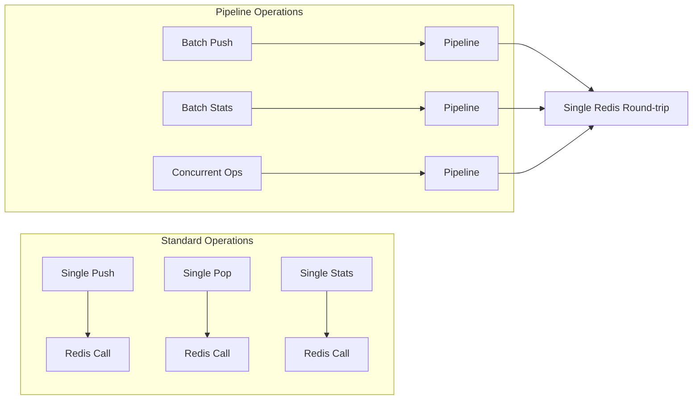
```mermaid
graph LR
    subgraph "Standard Operations"
        S1[Single Push] --> R1[Redis Call]
        S2[Single Pop] --> R2[Redis Call]
        S3[Single Stats] --> R3[Redis Call]
    end
    
    subgraph "Pipeline Operations"
        B1[Batch Push] --> P1[Pipeline]
        B2[Batch Stats] --> P2[Pipeline]
        B3[Concurrent Ops] --> P3[Pipeline]
    end
    
    P1 --> R4[Single Redis Round-trip]
    P2 --> R4
    P3 --> R4
```

### 2. Lua Script Caching

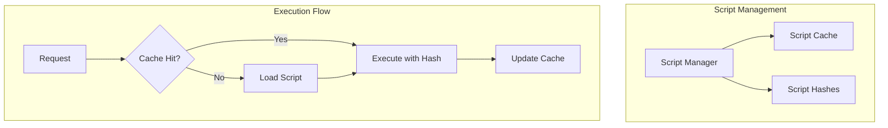
```mermaid
graph TB
    subgraph "Script Management"
        SM[Script Manager]
        SC[Script Cache]
        SH[Script Hashes]
    end
    
    SM --> SC
    SM --> SH
    
    subgraph "Execution Flow"
        REQ[Request]
        REQ --> CH{Cache Hit?}
        CH -->|Yes| EX[Execute with Hash]
        CH -->|No| LD[Load Script]
        LD --> EX
        EX --> UP[Update Cache]
    end
```

### 3. Connection Pooling

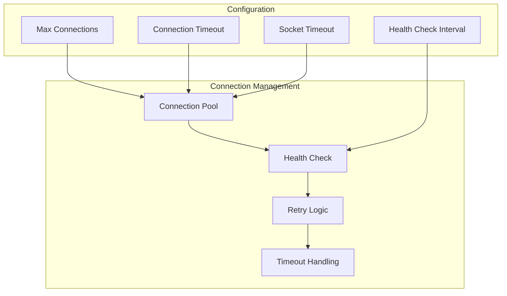
```mermaid
graph TB
    subgraph "Connection Management"
        CP[Connection Pool]
        HC[Health Check]
        RT[Retry Logic]
        TO[Timeout Handling]
    end
    
    CP --> HC
    HC --> RT
    RT --> TO
    
    subgraph "Configuration"
        MC[Max Connections]
        CT[Connection Timeout]
        ST[Socket Timeout]
        HI[Health Check Interval]
    end
    
    MC --> CP
    CT --> CP
    ST --> CP
    HI --> HC
```

## Scalability

### Horizontal Scaling

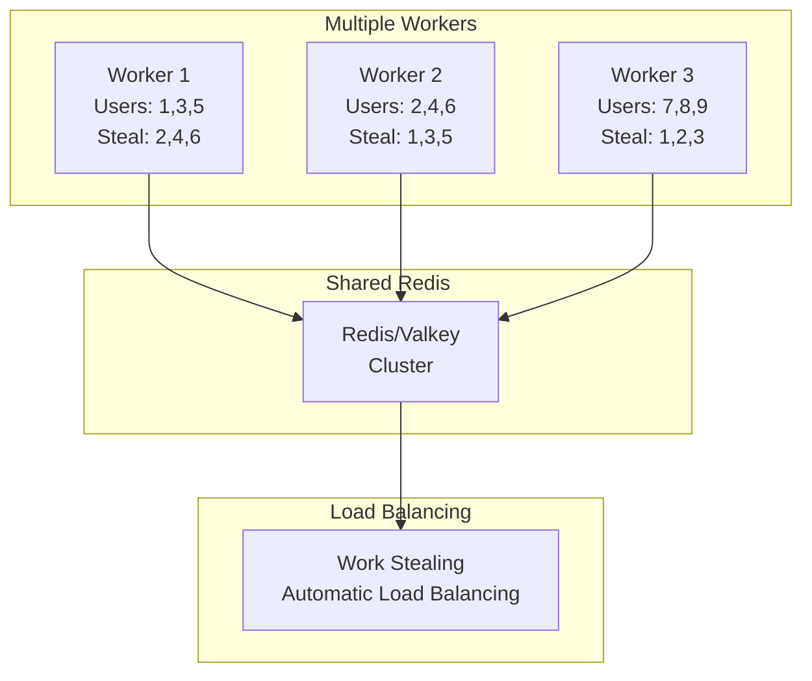
```mermaid
graph TB
    subgraph "Multiple Workers"
        W1[Worker 1<br/>Users: 1,3,5<br/>Steal: 2,4,6]
        W2[Worker 2<br/>Users: 2,4,6<br/>Steal: 1,3,5]
        W3[Worker 3<br/>Users: 7,8,9<br/>Steal: 1,2,3]
    end
    
    subgraph "Shared Redis"
        R[Redis/Valkey<br/>Cluster]
    end
    
    W1 --> R
    W2 --> R
    W3 --> R
    
    subgraph "Load Balancing"
        LB[Work Stealing<br/>Automatic Load Balancing]
    end
    
    R --> LB
```

### Vertical Scaling

- **Redis Memory**: Scale based on queue sizes and task payload sizes
- **CPU Cores**: Workers can run multiple concurrent tasks
- **Network Bandwidth**: Consider task payload sizes and operation frequency

### Monitoring and Observability

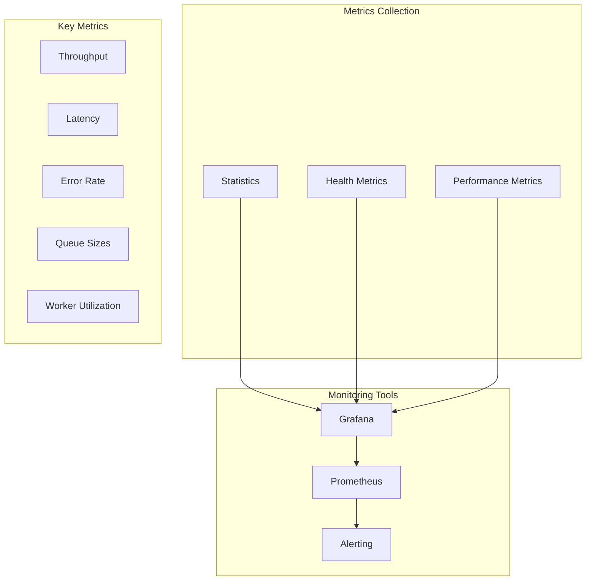
```mermaid
graph TB
    subgraph "Metrics Collection"
        ST[Statistics]
        HM[Health Metrics]
        PM[Performance Metrics]
    end
    
    subgraph "Monitoring Tools"
        GF[Grafana]
        PR[Prometheus]
        AL[Alerting]
    end
    
    ST --> GF
    HM --> GF
    PM --> GF
    
    GF --> PR
    PR --> AL
    
    subgraph "Key Metrics"
        TP[Throughput]
        LT[Latency]
        ER[Error Rate]
        QS[Queue Sizes]
        WU[Worker Utilization]
    end
```

This architecture provides a robust, scalable, and production-ready task queue system with fair scheduling, work stealing, and comprehensive monitoring capabilities.
