# FairQueue アーキテクチャドキュメント

## 目次
1. [概要](#概要)
2. [システムアーキテクチャ](#システムアーキテクチャ)
3. [コアコンポーネント](#コアコンポーネント)
4. [データフロー](#データフロー)
5. [優先度システム](#優先度システム)
6. [ワークスティーリング戦略](#ワークスティーリング戦略)
7. [設定管理](#設定管理)
8. [実装パターン](#実装パターン)
9. [パフォーマンス考慮事項](#パフォーマンス考慮事項)
10. [スケーラビリティ](#スケーラビリティ)

## 概要

FairQueueは、ワークスティーリングと優先度スケジューリングを備えたRedisベースの本格的な公平キュー実装です。このシステムは、高いパフォーマンスと信頼性を維持しながら、複数のユーザー間で公平なタスク分散を提供するように設計されています。

### 主要機能
- **公平スケジューリング**: ワークスティーリング機能付きラウンドロビンユーザー選択
- **優先度キュー**: クリティカル/ノーマル分離を持つタイプセーフな優先度システム（1-6）
- **アトミック操作**: Luaスクリプトによる一貫性とパフォーマンスの保証
- **設定ベース**: ユーザー管理のためのRedis状態なし、完全設定可能
- **デュアル実装**: 同期・非同期両方のバージョン
- **プロダクション対応**: エラーハンドリング、グレースフルシャットダウン、ヘルスチェック

## システムアーキテクチャ

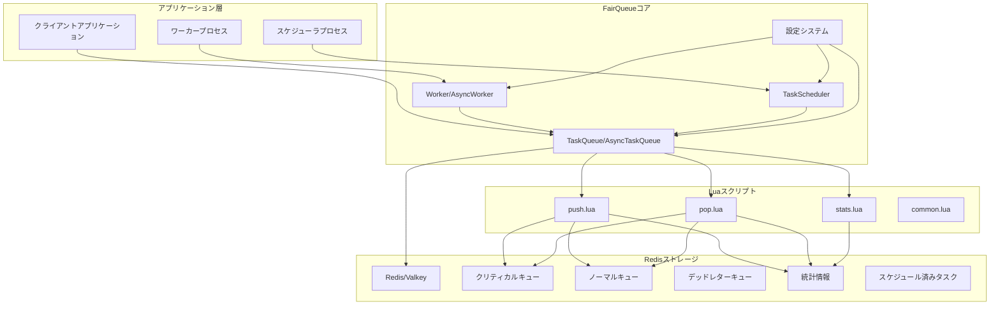
```mermaid
graph TB
    subgraph "アプリケーション層"
        A[クライアントアプリケーション]
        W[ワーカープロセス]
        S[スケジューラプロセス]
    end
    
    subgraph "FairQueueコア"
        TQ[TaskQueue/AsyncTaskQueue]
        WR[Worker/AsyncWorker]
        SC[TaskScheduler]
        CFG[設定システム]
    end
    
    subgraph "Redisストレージ"
        R[Redis/Valkey]
        CQ[クリティカルキュー]
        NQ[ノーマルキュー]
        DLQ[デッドレターキュー]
        ST[統計情報]
        SCH[スケジュール済みタスク]
    end
    
    subgraph "Luaスクリプト"
        PS[push.lua]
        POP[pop.lua]
        STATS[stats.lua]
        COMMON[common.lua]
    end
    
    A --> TQ
    W --> WR
    S --> SC
    TQ --> R
    WR --> TQ
    SC --> TQ
    
    TQ --> PS
    TQ --> POP
    TQ --> STATS
    
    PS --> CQ
    PS --> NQ
    PS --> ST
    POP --> CQ
    POP --> NQ
    POP --> ST
    STATS --> ST
    
    CFG --> TQ
    CFG --> WR
    CFG --> SC
```

## コアコンポーネント

### 1. タスクキュー (`TaskQueue`/`AsyncTaskQueue`)

タスクの保存と取得操作を管理する中央コンポーネント。

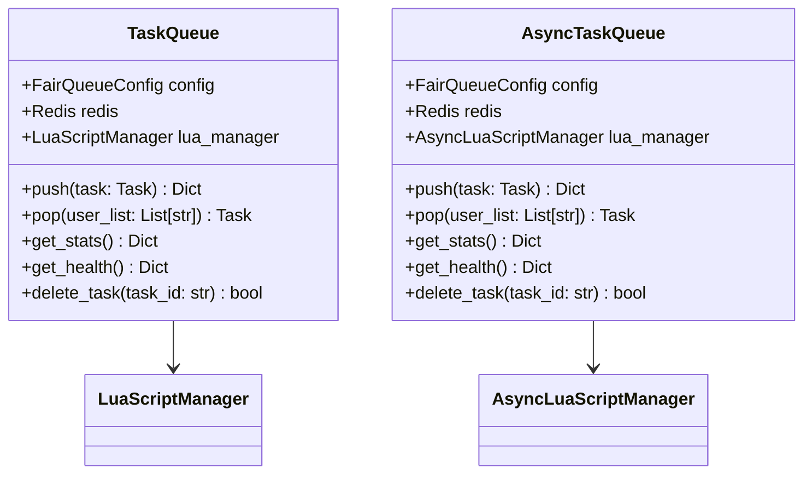
```mermaid
classDiagram
    class TaskQueue {
        +FairQueueConfig config
        +Redis redis
        +LuaScriptManager lua_manager
        +push(task: Task) Dict
        +pop(user_list: List[str]) Task
        +get_stats() Dict
        +get_health() Dict
        +delete_task(task_id: str) bool
    }
    
    class AsyncTaskQueue {
        +FairQueueConfig config
        +Redis redis
        +AsyncLuaScriptManager lua_manager
        +push(task: Task) Dict
        +pop(user_list: List[str]) Task
        +get_stats() Dict
        +get_health() Dict
        +delete_task(task_id: str) bool
    }
    
    TaskQueue --> LuaScriptManager
    AsyncTaskQueue --> AsyncLuaScriptManager
```

### 2. ワーカーシステム (`Worker`/`AsyncWorker`)

ワークスティーリング機能付きのタスク処理。

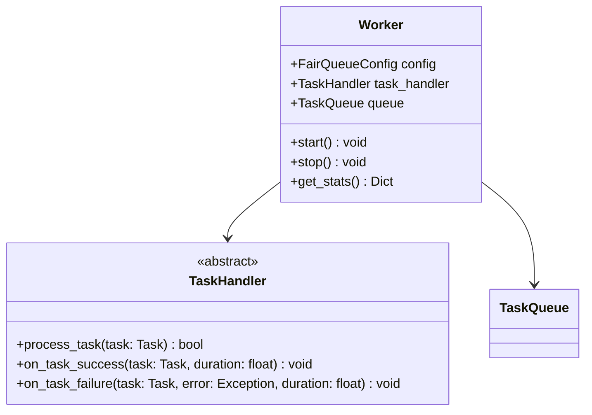
```mermaid
classDiagram
    class Worker {
        +FairQueueConfig config
        +TaskHandler task_handler
        +TaskQueue queue
        +start() void
        +stop() void
        +get_stats() Dict
    }
    
    class TaskHandler {
        <<abstract>>
        +process_task(task: Task) bool
        +on_task_success(task: Task, duration: float) void
        +on_task_failure(task: Task, error: Exception, duration: float) void
    }
    
    Worker --> TaskHandler
    Worker --> TaskQueue
```

### 3. タスクスケジューラ (`TaskScheduler`)

分散ロック付きcronベースのタスクスケジューリング管理。

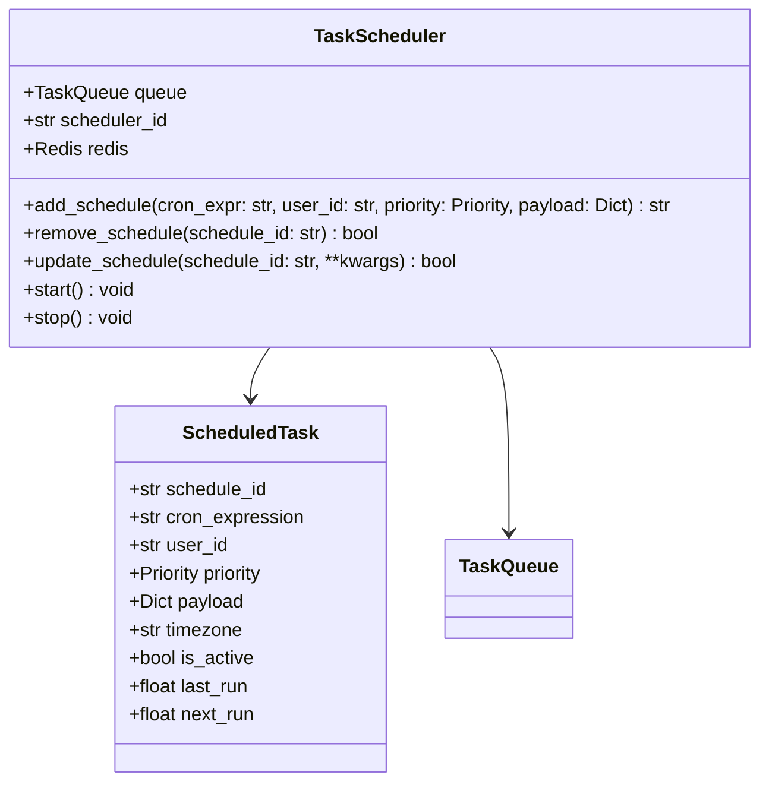
```mermaid
classDiagram
    class TaskScheduler {
        +TaskQueue queue
        +str scheduler_id
        +Redis redis
        +add_schedule(cron_expr: str, user_id: str, priority: Priority, payload: Dict) str
        +remove_schedule(schedule_id: str) bool
        +update_schedule(schedule_id: str, **kwargs) bool
        +start() void
        +stop() void
    }
    
    class ScheduledTask {
        +str schedule_id
        +str cron_expression
        +str user_id
        +Priority priority
        +Dict payload
        +str timezone
        +bool is_active
        +float last_run
        +float next_run
    }
    
    TaskScheduler --> ScheduledTask
    TaskScheduler --> TaskQueue
```

### 4. 設定システム

全コンポーネントの統一設定管理。

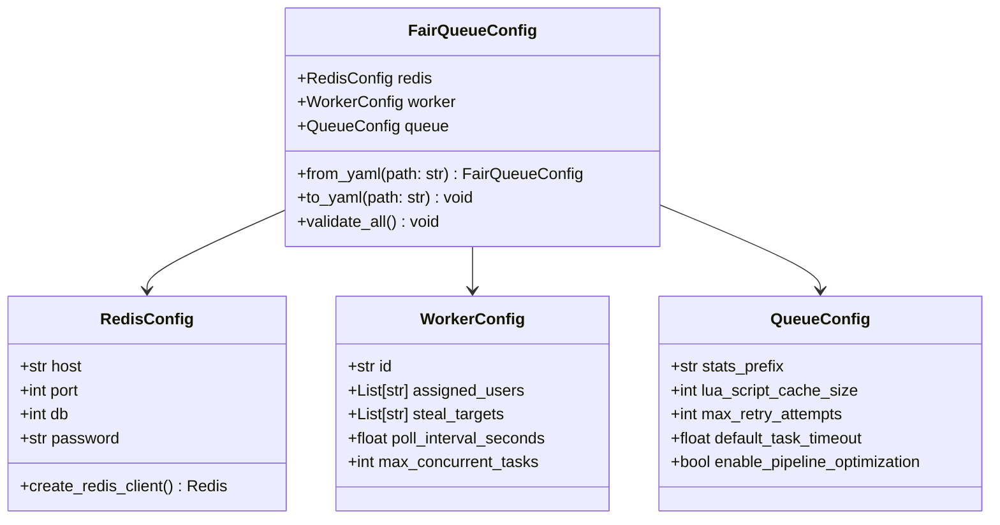
```mermaid
classDiagram
    class FairQueueConfig {
        +RedisConfig redis
        +WorkerConfig worker
        +QueueConfig queue
        +from_yaml(path: str) FairQueueConfig
        +to_yaml(path: str) void
        +validate_all() void
    }
    
    class RedisConfig {
        +str host
        +int port
        +int db
        +str password
        +create_redis_client() Redis
    }
    
    class WorkerConfig {
        +str id
        +List[str] assigned_users
        +List[str] steal_targets
        +float poll_interval_seconds
        +int max_concurrent_tasks
    }
    
    class QueueConfig {
        +str stats_prefix
        +int lua_script_cache_size
        +int max_retry_attempts
        +float default_task_timeout
        +bool enable_pipeline_optimization
    }
    
    FairQueueConfig --> RedisConfig
    FairQueueConfig --> WorkerConfig
    FairQueueConfig --> QueueConfig
```

## データフロー

### タスク投入フロー

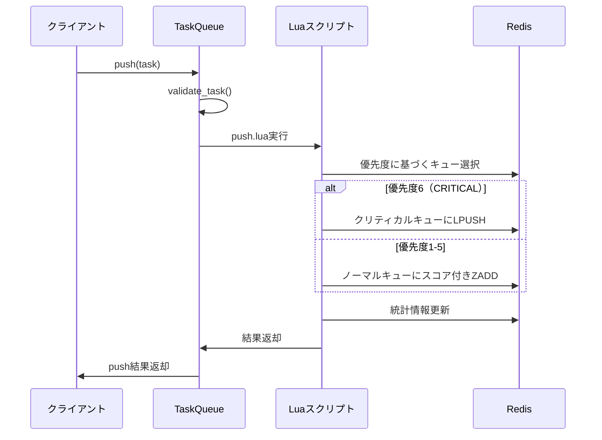
```mermaid
sequenceDiagram
    participant C as クライアント
    participant TQ as TaskQueue
    participant L as Luaスクリプト
    participant R as Redis
    
    C->>TQ: push(task)
    TQ->>TQ: validate_task()
    TQ->>L: push.lua実行
    L->>R: 優先度に基づくキュー選択
    alt 優先度6（CRITICAL）
        L->>R: クリティカルキューにLPUSH
    else 優先度1-5
        L->>R: ノーマルキューにスコア付きZADD
    end
    L->>R: 統計情報更新
    L->>TQ: 結果返却
    TQ->>C: push結果返却
```

### タスク処理フロー

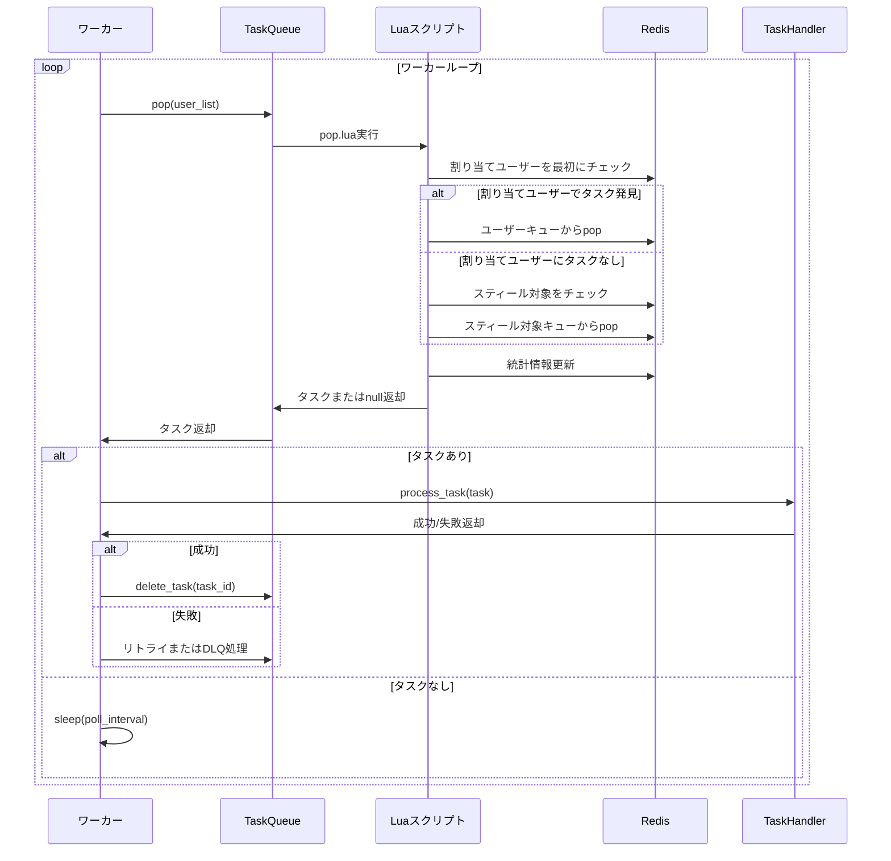
```mermaid
sequenceDiagram
    participant W as ワーカー
    participant TQ as TaskQueue
    participant L as Luaスクリプト
    participant R as Redis
    participant TH as TaskHandler
    
    loop ワーカーループ
        W->>TQ: pop(user_list)
        TQ->>L: pop.lua実行
        L->>R: 割り当てユーザーを最初にチェック
        alt 割り当てユーザーでタスク発見
            L->>R: ユーザーキューからpop
        else 割り当てユーザーにタスクなし
            L->>R: スティール対象をチェック
            L->>R: スティール対象キューからpop
        end
        L->>R: 統計情報更新
        L->>TQ: タスクまたはnull返却
        TQ->>W: タスク返却
        
        alt タスクあり
            W->>TH: process_task(task)
            TH->>W: 成功/失敗返却
            alt 成功
                W->>TQ: delete_task(task_id)
            else 失敗
                W->>TQ: リトライまたはDLQ処理
            end
        else タスクなし
            W->>W: sleep(poll_interval)
        end
    end
```

## 優先度システム

FairQueueは2つのキュータイプを持つ洗練された優先度システムを実装しています：

### 優先度レベル

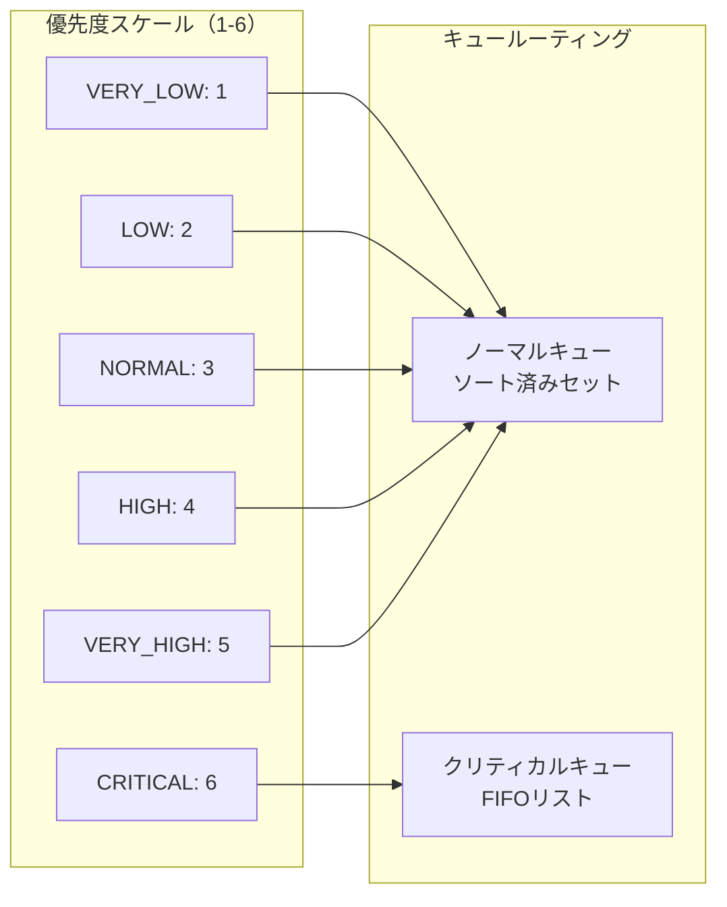
```mermaid
graph LR
    subgraph "優先度スケール（1-6）"
        P1[VERY_LOW: 1]
        P2[LOW: 2]
        P3[NORMAL: 3]
        P4[HIGH: 4]
        P5[VERY_HIGH: 5]
        P6[CRITICAL: 6]
    end
    
    subgraph "キュールーティング"
        P1 --> NQ[ノーマルキュー<br/>ソート済みセット]
        P2 --> NQ
        P3 --> NQ
        P4 --> NQ
        P5 --> NQ
        P6 --> CQ[クリティカルキュー<br/>FIFOリスト]
    end
```

### キュー構造

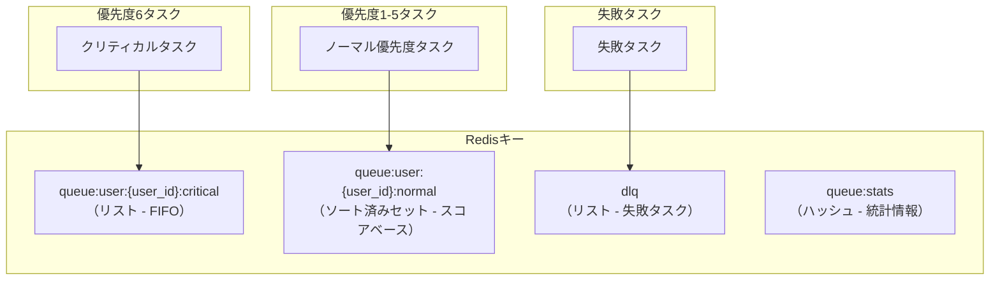
```mermaid
graph TB
    subgraph "Redisキー"
        CQ["queue:user:{user_id}:critical<br/>（リスト - FIFO）"]
        NQ["queue:user:{user_id}:normal<br/>（ソート済みセット - スコアベース）"]
        DLQ["dlq<br/>（リスト - 失敗タスク）"]
        ST["queue:stats<br/>（ハッシュ - 統計情報）"]
    end
    
    subgraph "優先度6タスク"
        T6[クリティカルタスク] --> CQ
    end
    
    subgraph "優先度1-5タスク"
        T15[ノーマル優先度タスク] --> NQ
    end
    
    subgraph "失敗タスク"
        FT[失敗タスク] --> DLQ
    end
```

### ノーマルキューのスコアリングアルゴリズム

優先度1-5のタスクについて、スコアは次のように計算されます：

```
score = created_at + (priority_weight * elapsed_time)
priority_weight = priority / 5.0
elapsed_time = current_time - created_at
```

これにより、より高い優先度のタスクと古いタスクが最初に処理されることが保証されます。

## ワークスティーリング戦略

ワーカーは負荷分散のための洗練されたワークスティーリング戦略を実装しています：

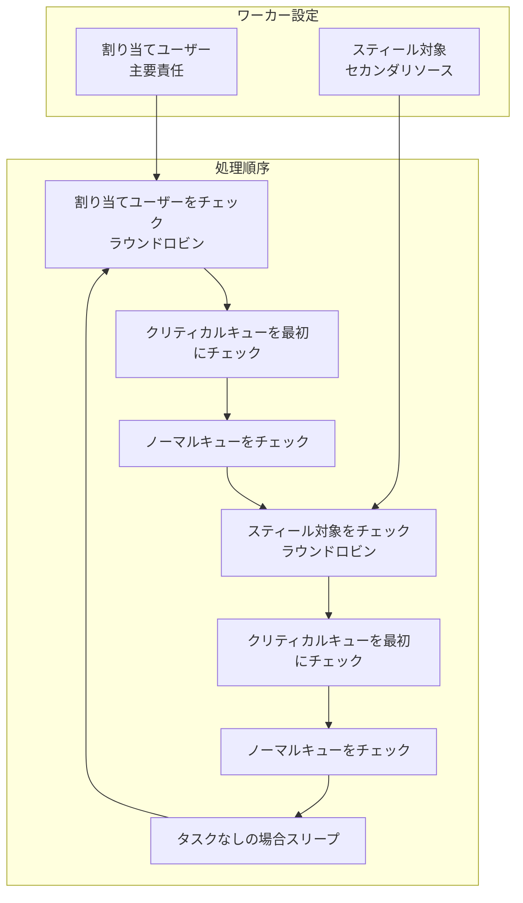
```mermaid
graph TD
    subgraph "ワーカー設定"
        AU[割り当てユーザー<br/>主要責任]
        ST[スティール対象<br/>セカンダリソース]
    end
    
    subgraph "処理順序"
        A1[割り当てユーザーをチェック<br/>ラウンドロビン]
        A2[クリティカルキューを最初にチェック]
        A3[ノーマルキューをチェック]
        B1[スティール対象をチェック<br/>ラウンドロビン]
        B2[クリティカルキューを最初にチェック]
        B3[ノーマルキューをチェック]
        C[タスクなしの場合スリープ]
    end
    
    AU --> A1
    A1 --> A2
    A2 --> A3
    A3 --> B1
    ST --> B1
    B1 --> B2
    B2 --> B3
    B3 --> C
    C --> A1
```

### 設定例

```yaml
worker:
  id: "worker-001"
  assigned_users: ["user:1", "user:3", "user:5"]  # 主要責任
  steal_targets: ["user:2", "user:4", "user:6"]   # これらからスティール可能
  poll_interval_seconds: 1.0
  max_concurrent_tasks: 10
```

## 設定管理

### 統一設定構造

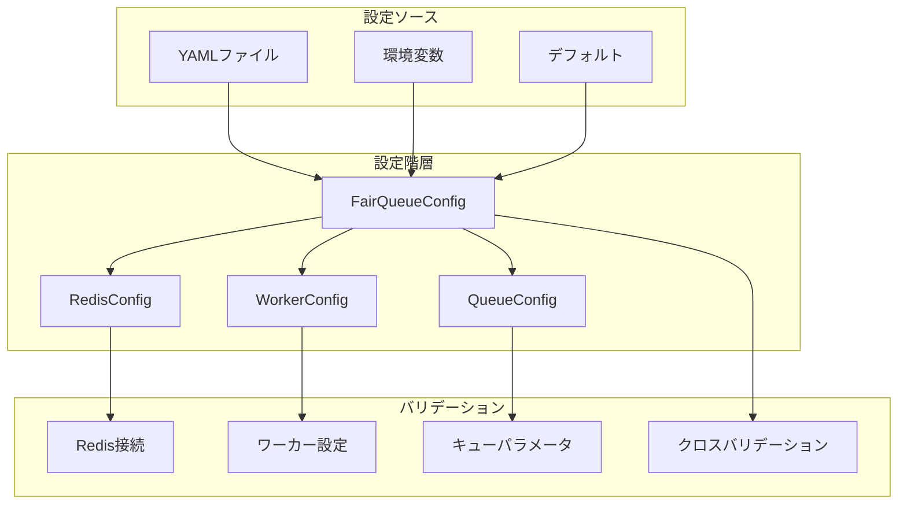
```mermaid
graph TB
    subgraph "設定階層"
        FC[FairQueueConfig]
        RC[RedisConfig]
        WC[WorkerConfig]
        QC[QueueConfig]
    end
    
    FC --> RC
    FC --> WC
    FC --> QC
    
    subgraph "設定ソース"
        YF[YAMLファイル]
        ENV[環境変数]
        DEF[デフォルト]
    end
    
    YF --> FC
    ENV --> FC
    DEF --> FC
    
    subgraph "バリデーション"
        V1[Redis接続]
        V2[ワーカー設定]
        V3[キューパラメータ]
        V4[クロスバリデーション]
    end
    
    RC --> V1
    WC --> V2
    QC --> V3
    FC --> V4
```

## 実装パターン

### 1. Luaスクリプトアーキテクチャ

すべてのクリティカルな操作はアトミックなLuaスクリプトとして実装されています：

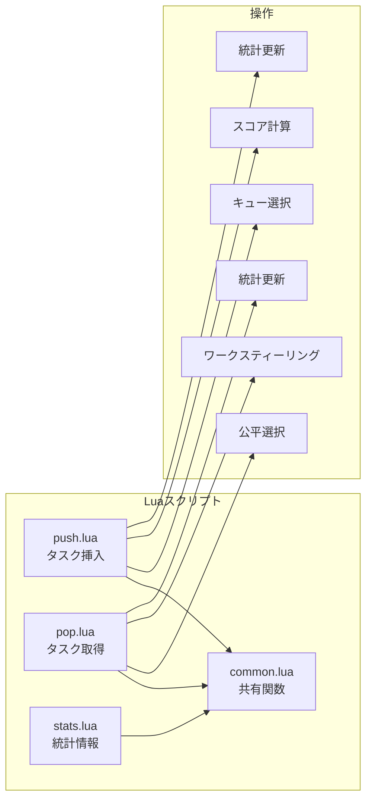
```mermaid
graph LR
    subgraph "Luaスクリプト"
        CM[common.lua<br/>共有関数]
        PS[push.lua<br/>タスク挿入]
        PP[pop.lua<br/>タスク取得]
        ST[stats.lua<br/>統計情報]
    end
    
    PS --> CM
    PP --> CM
    ST --> CM
    
    subgraph "操作"
        PS --> QS[キュー選択]
        PS --> SC[スコア計算]
        PS --> SU[統計更新]
        
        PP --> FS[公平選択]
        PP --> WS[ワークスティーリング]
        PP --> SU2[統計更新]
    end
```

### 2. エラーハンドリング戦略

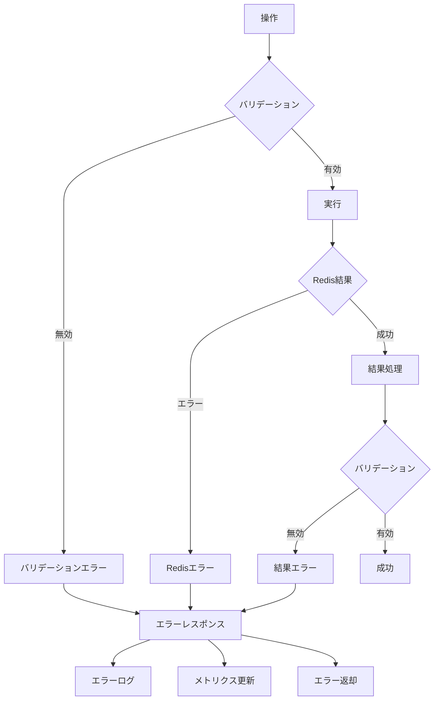
```mermaid
graph TD
    OP[操作]
    OP --> V{バリデーション}
    V -->|無効| E1[バリデーションエラー]
    V -->|有効| EX[実行]
    EX --> R{Redis結果}
    R -->|エラー| E2[Redisエラー]
    R -->|成功| PR[結果処理]
    PR --> V2{バリデーション}
    V2 -->|無効| E3[結果エラー]
    V2 -->|有効| S[成功]
    
    E1 --> ER[エラーレスポンス]
    E2 --> ER
    E3 --> ER
    
    ER --> L[エラーログ]
    ER --> M[メトリクス更新]
    ER --> RT[エラー返却]
```

### 3. デュアル実装パターン

FairQueueは同期・非同期両方の実装を提供します：

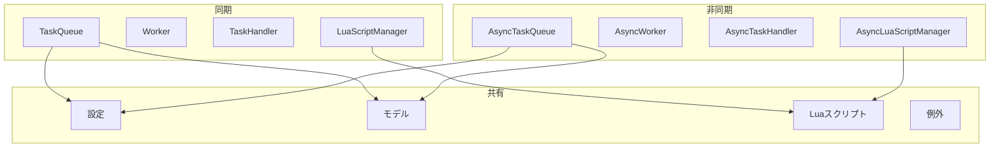
```mermaid
graph TB
    subgraph "同期"
        TQ[TaskQueue]
        W[Worker]
        TH[TaskHandler]
        LSM[LuaScriptManager]
    end
    
    subgraph "非同期"
        ATQ[AsyncTaskQueue]
        AW[AsyncWorker]
        ATH[AsyncTaskHandler]
        ALSM[AsyncLuaScriptManager]
    end
    
    subgraph "共有"
        CFG[設定]
        MOD[モデル]
        LUA[Luaスクリプト]
        EXC[例外]
    end
    
    TQ --> CFG
    ATQ --> CFG
    TQ --> MOD
    ATQ --> MOD
    LSM --> LUA
    ALSM --> LUA
```

## パフォーマンス考慮事項

### 1. パイプライン最適化

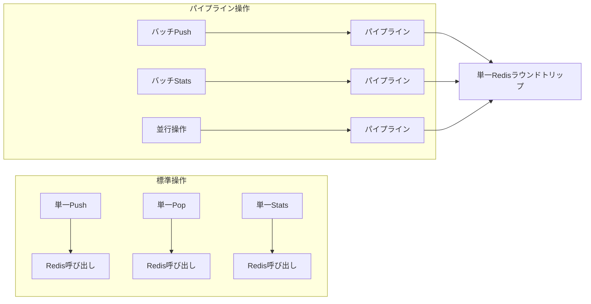
```mermaid
graph LR
    subgraph "標準操作"
        S1[単一Push] --> R1[Redis呼び出し]
        S2[単一Pop] --> R2[Redis呼び出し]
        S3[単一Stats] --> R3[Redis呼び出し]
    end
    
    subgraph "パイプライン操作"
        B1[バッチPush] --> P1[パイプライン]
        B2[バッチStats] --> P2[パイプライン]
        B3[並行操作] --> P3[パイプライン]
    end
    
    P1 --> R4[単一Redisラウンドトリップ]
    P2 --> R4
    P3 --> R4
```

### 2. Luaスクリプトキャッシング

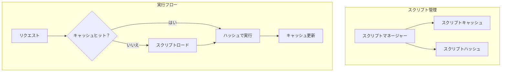
```mermaid
graph TB
    subgraph "スクリプト管理"
        SM[スクリプトマネージャー]
        SC[スクリプトキャッシュ]
        SH[スクリプトハッシュ]
    end
    
    SM --> SC
    SM --> SH
    
    subgraph "実行フロー"
        REQ[リクエスト]
        REQ --> CH{キャッシュヒット？}
        CH -->|はい| EX[ハッシュで実行]
        CH -->|いいえ| LD[スクリプトロード]
        LD --> EX
        EX --> UP[キャッシュ更新]
    end
```

### 3. コネクションプーリング

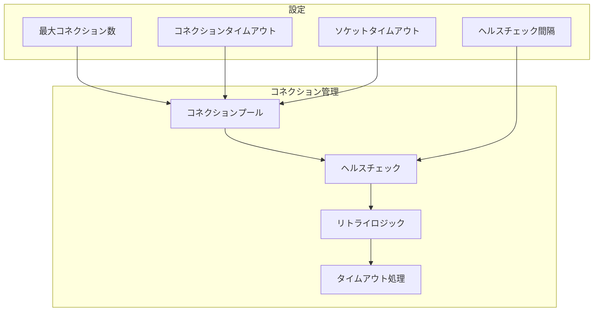
```mermaid
graph TB
    subgraph "コネクション管理"
        CP[コネクションプール]
        HC[ヘルスチェック]
        RT[リトライロジック]
        TO[タイムアウト処理]
    end
    
    CP --> HC
    HC --> RT
    RT --> TO
    
    subgraph "設定"
        MC[最大コネクション数]
        CT[コネクションタイムアウト]
        ST[ソケットタイムアウト]
        HI[ヘルスチェック間隔]
    end
    
    MC --> CP
    CT --> CP
    ST --> CP
    HI --> HC
```

## スケーラビリティ

### 水平スケーリング

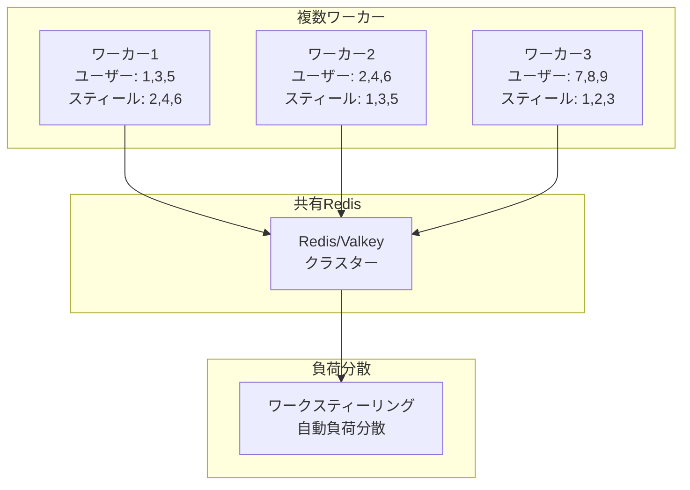
```mermaid
graph TB
    subgraph "複数ワーカー"
        W1[ワーカー1<br/>ユーザー: 1,3,5<br/>スティール: 2,4,6]
        W2[ワーカー2<br/>ユーザー: 2,4,6<br/>スティール: 1,3,5]
        W3[ワーカー3<br/>ユーザー: 7,8,9<br/>スティール: 1,2,3]
    end
    
    subgraph "共有Redis"
        R[Redis/Valkey<br/>クラスター]
    end
    
    W1 --> R
    W2 --> R
    W3 --> R
    
    subgraph "負荷分散"
        LB[ワークスティーリング<br/>自動負荷分散]
    end
    
    R --> LB
```

### 垂直スケーリング

- **Redisメモリ**: キューサイズとタスクペイロードサイズに基づくスケーリング
- **CPUコア**: ワーカーは複数の並行タスクを実行可能
- **ネットワーク帯域幅**: タスクペイロードサイズと操作頻度を考慮

### 監視と可観測性

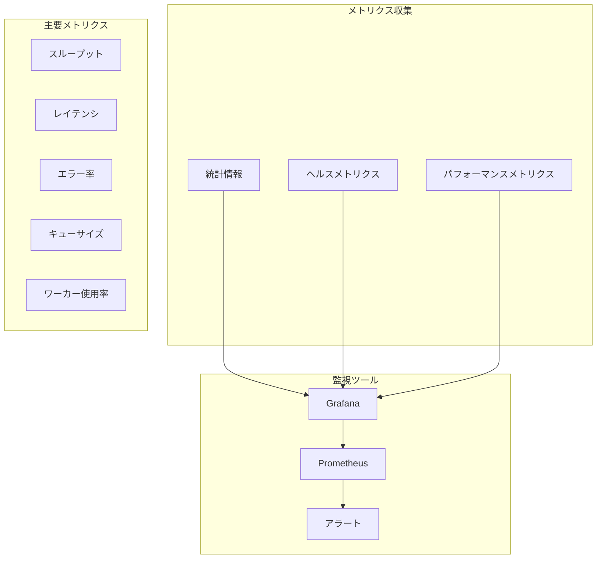
```mermaid
graph TB
    subgraph "メトリクス収集"
        ST[統計情報]
        HM[ヘルスメトリクス]
        PM[パフォーマンスメトリクス]
    end
    
    subgraph "監視ツール"
        GF[Grafana]
        PR[Prometheus]
        AL[アラート]
    end
    
    ST --> GF
    HM --> GF
    PM --> GF
    
    GF --> PR
    PR --> AL
    
    subgraph "主要メトリクス"
        TP[スループット]
        LT[レイテンシ]
        ER[エラー率]
        QS[キューサイズ]
        WU[ワーカー使用率]
    end
```

このアーキテクチャは、公平スケジューリング、ワークスティーリング、包括的な監視機能を備えた堅牢でスケーラブル、かつプロダクション対応のタスクキューシステムを提供します。
