# FairQueue Scheduler Process Sequence

## Overview

The FairQueue Scheduler is responsible for managing cron-based task scheduling with distributed locking. It ensures that scheduled tasks are executed at the right time across multiple scheduler instances without conflicts.

## Table of Contents
1. [Scheduler Initialization](#scheduler-initialization)
2. [Schedule Management](#schedule-management)
3. [Task Execution Cycle](#task-execution-cycle)
4. [Distributed Locking](#distributed-locking)
5. [Error Handling](#error-handling)
6. [Shutdown Process](#shutdown-process)

## Scheduler Initialization

The scheduler initialization process sets up the necessary components and validates the configuration.

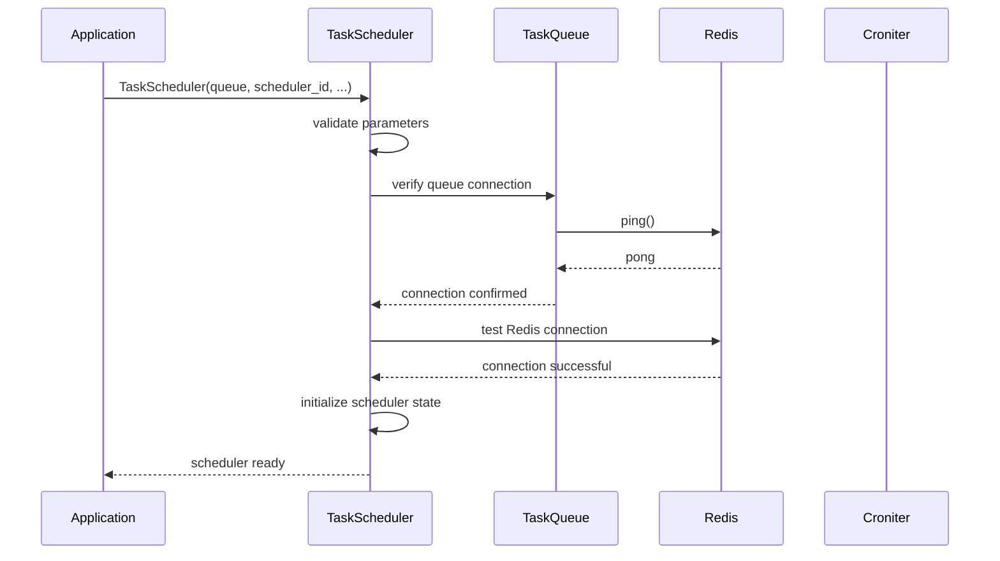

### Initialization Steps

1. **Parameter Validation**: Validate scheduler ID, queue instance, and configuration
2. **Queue Connection**: Verify that the TaskQueue is properly connected
3. **Redis Connection**: Test direct Redis connection for schedule storage
4. **State Initialization**: Set up internal state and threading components

## Schedule Management

### Adding a Schedule

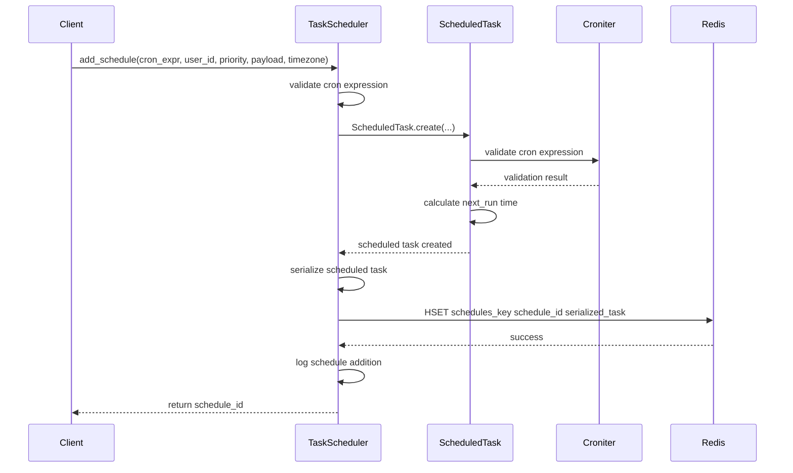

### Updating a Schedule

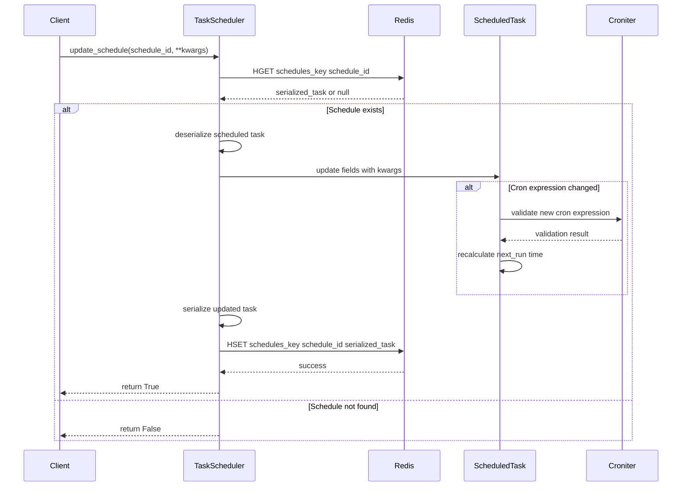

### Removing a Schedule

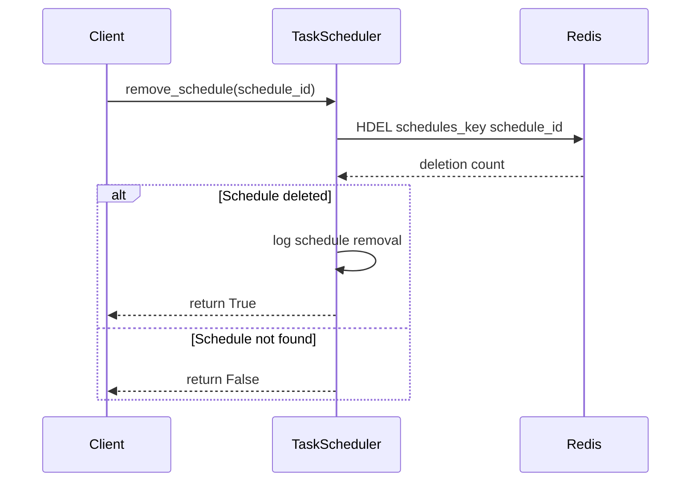

## Task Execution Cycle

The main scheduler loop runs continuously, checking for due tasks and executing them.

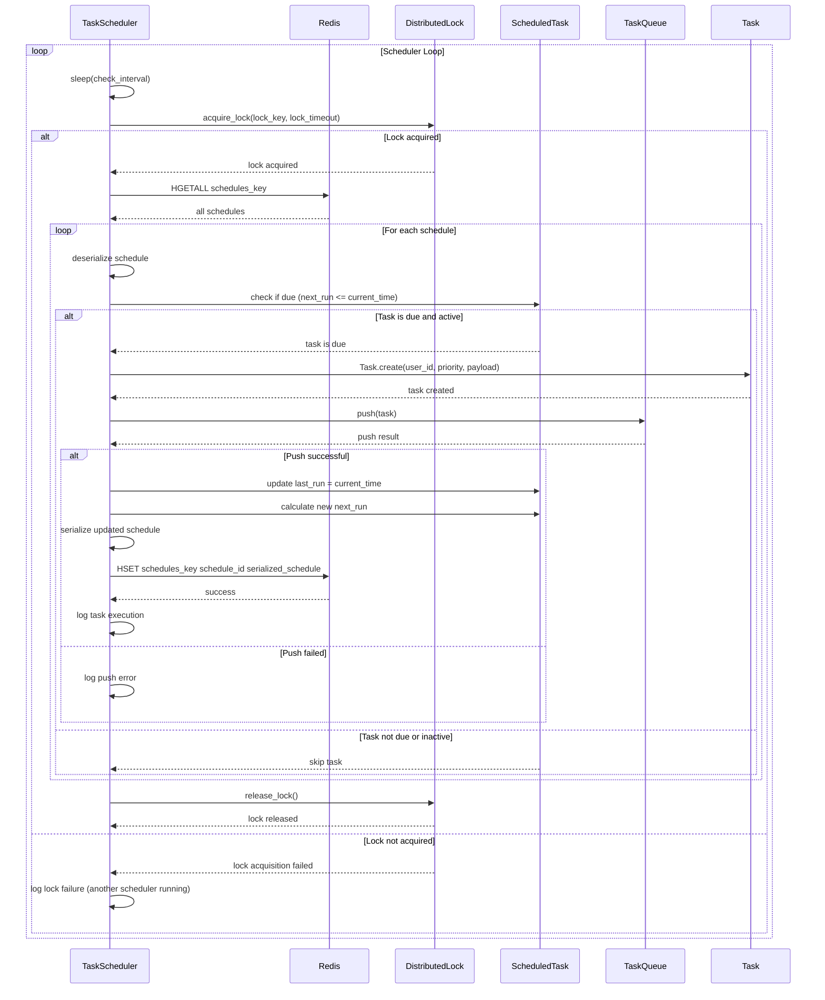

### Detailed Task Execution Flow

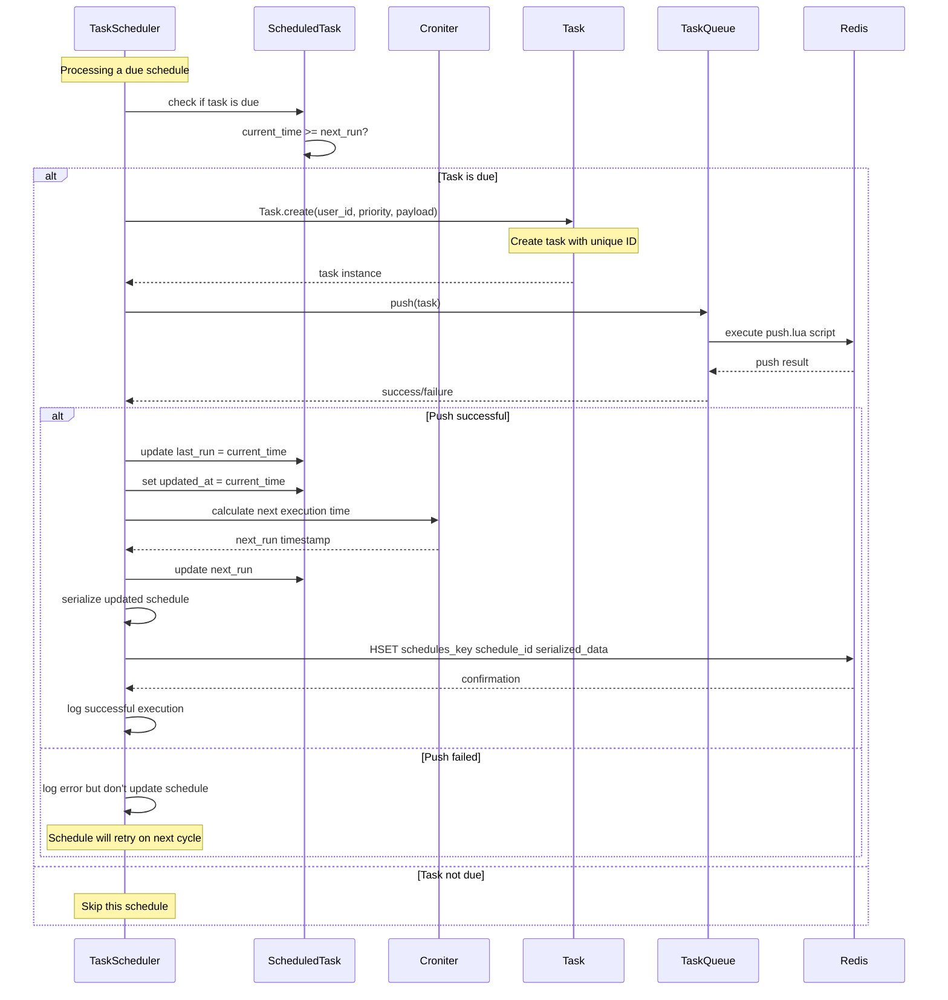

## Distributed Locking

The scheduler uses Redis-based distributed locking to ensure only one scheduler instance processes tasks at a time.

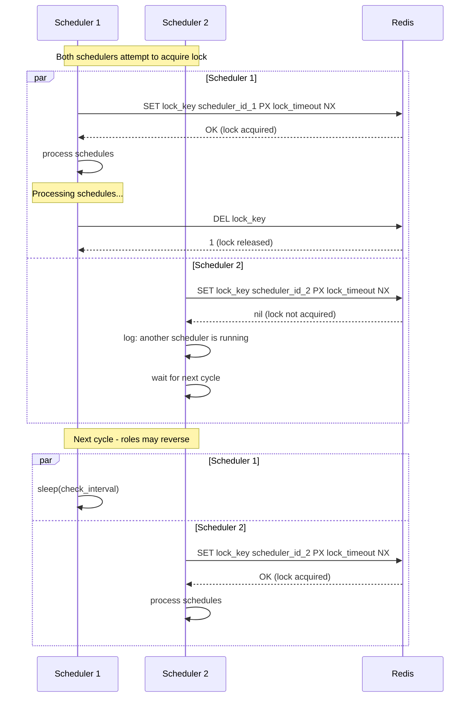

### Lock Implementation Details

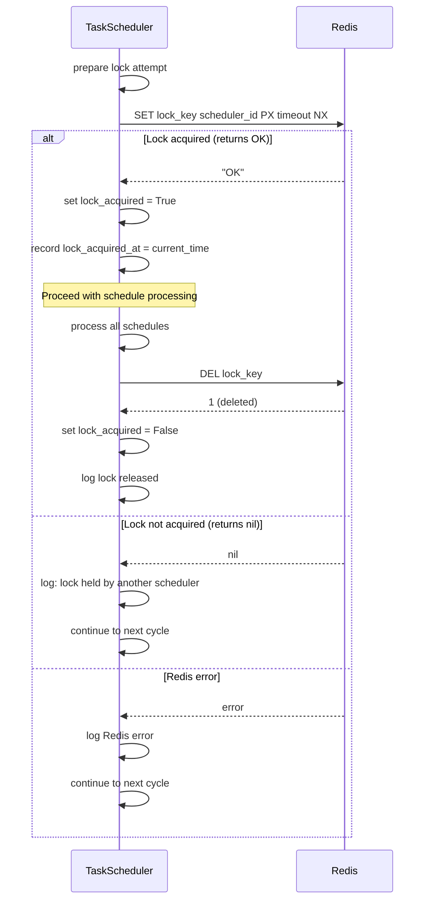

## Error Handling

The scheduler implements comprehensive error handling for various failure scenarios.

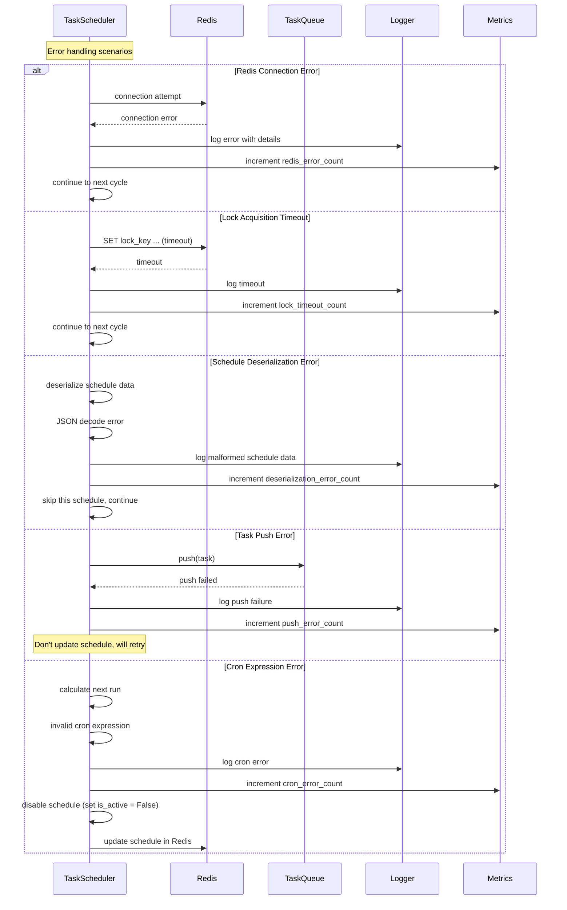

### Error Recovery Strategies

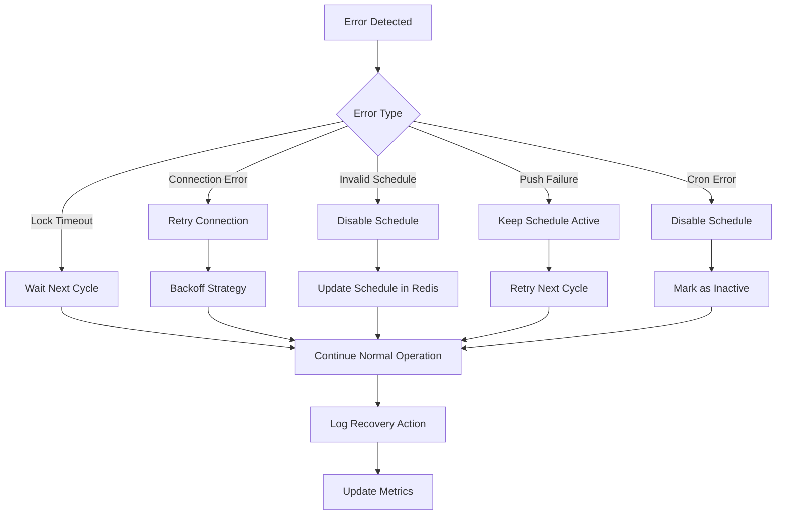

## Shutdown Process

The scheduler supports graceful shutdown to ensure clean termination.

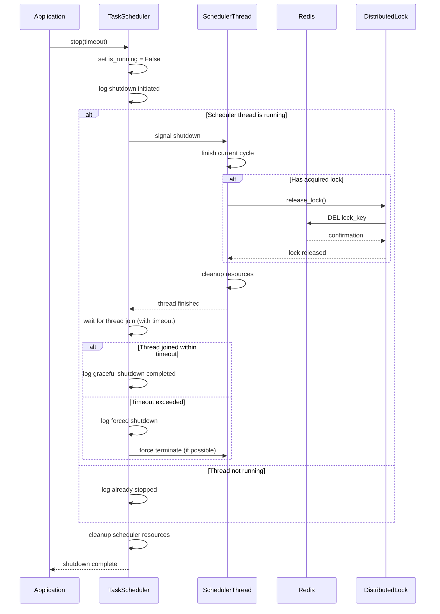

### Shutdown State Transitions

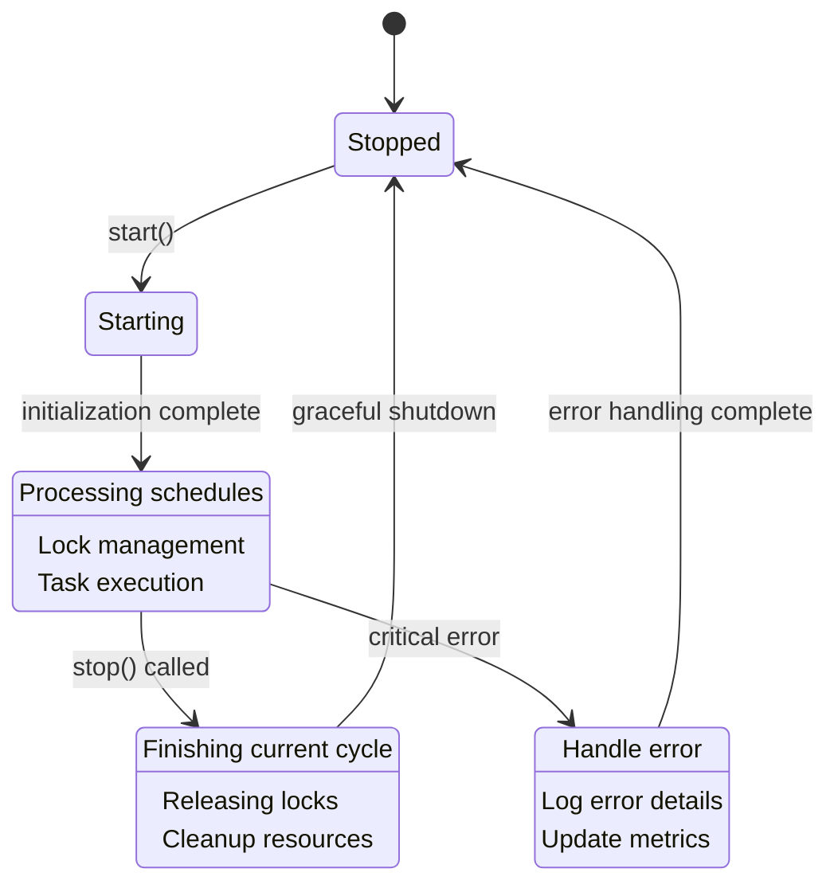

## Performance Considerations

### Optimization Strategies

1. **Schedule Caching**: Keep frequently accessed schedules in memory
2. **Batch Processing**: Process multiple due schedules in a single Redis transaction
3. **Lock Timeout Tuning**: Balance between scheduler availability and safety
4. **Check Interval Optimization**: Adjust based on schedule precision requirements

### Monitoring Points

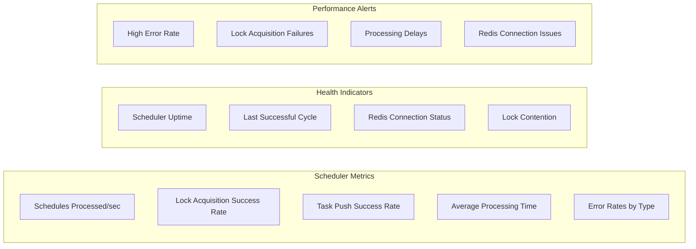

This sequence documentation provides a comprehensive understanding of how the FairQueue scheduler operates, from initialization through task execution to graceful shutdown, with robust error handling and performance monitoring throughout the process.
