# タスクスケジューラー処理シーケンス

このドキュメントでは、FairQueueのTaskSchedulerコンポーネントの詳細な処理シーケンスについて説明します。

## 概要

TaskSchedulerは、スケジュールされたタスクの管理とRedisベースの分散ロック機構を使用した実行を担当するコンポーネントです。定期的なタスクの実行、リスケジューリング、適切なエラーハンドリングを提供します。

## 1. スケジューラー初期化

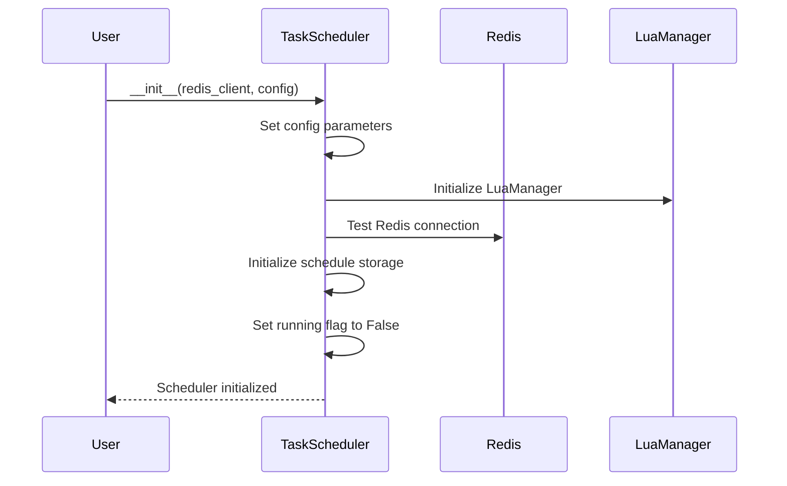
```mermaid
sequenceDiagram
    participant U as User
    participant TS as TaskScheduler
    participant R as Redis
    participant LM as LuaManager

    U->>TS: __init__(redis_client, config)
    TS->>TS: Set config parameters
    TS->>LM: Initialize LuaManager
    TS->>R: Test Redis connection
    TS->>TS: Initialize schedule storage
    TS->>TS: Set running flag to False
    TS-->>U: Scheduler initialized
```

### 初期化ステップ

1. **設定の設定**: Redisクライアントと設定パラメータを保存
2. **Luaマネージャーの初期化**: スクリプト管理用のLuaManagerを設定
3. **Redis接続テスト**: 接続の有効性を確認
4. **ストレージの初期化**: 内部スケジュールストレージを設定
5. **状態の初期化**: 実行フラグとその他の状態変数を初期化

## 2. スケジュール管理

### 2.1 タスクの追加

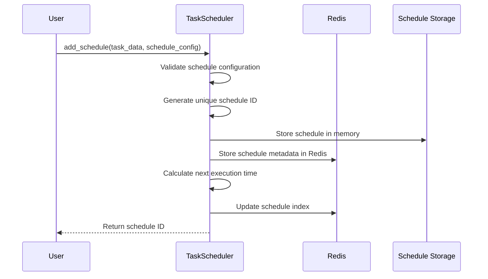
```mermaid
sequenceDiagram
    participant U as User
    participant TS as TaskScheduler
    participant R as Redis
    participant ST as Schedule Storage

    U->>TS: add_schedule(task_data, schedule_config)
    TS->>TS: Validate schedule configuration
    TS->>TS: Generate unique schedule ID
    TS->>ST: Store schedule in memory
    TS->>R: Store schedule metadata in Redis
    TS->>TS: Calculate next execution time
    TS->>R: Update schedule index
    TS-->>U: Return schedule ID
```

### 2.2 スケジュールの更新

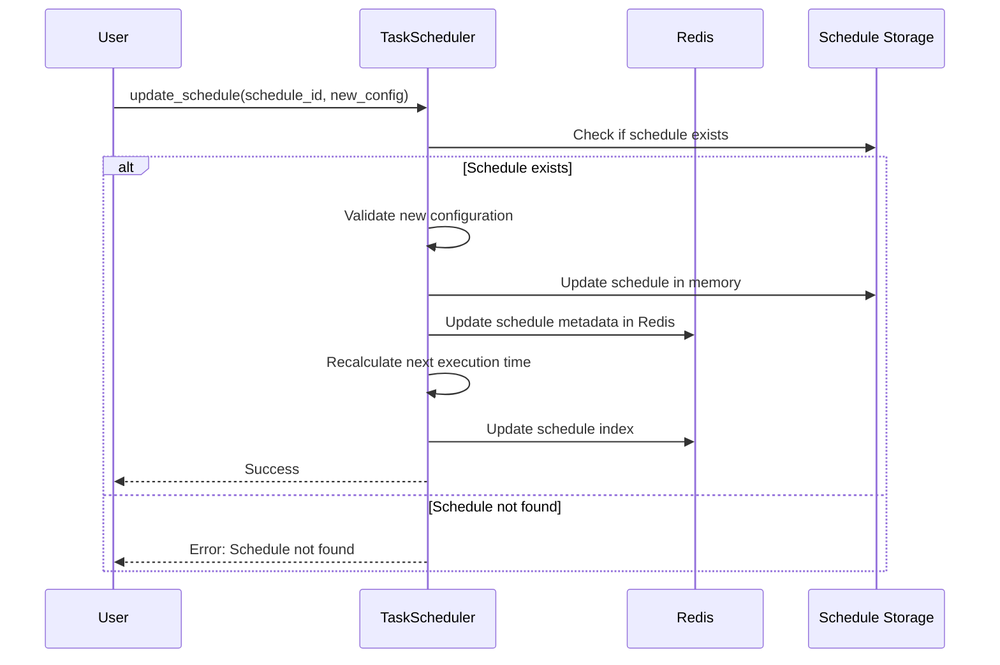
```mermaid
sequenceDiagram
    participant U as User
    participant TS as TaskScheduler
    participant R as Redis
    participant ST as Schedule Storage

    U->>TS: update_schedule(schedule_id, new_config)
    TS->>ST: Check if schedule exists
    alt Schedule exists
        TS->>TS: Validate new configuration
        TS->>ST: Update schedule in memory
        TS->>R: Update schedule metadata in Redis
        TS->>TS: Recalculate next execution time
        TS->>R: Update schedule index
        TS-->>U: Success
    else Schedule not found
        TS-->>U: Error: Schedule not found
    end
```

### 2.3 スケジュールの削除

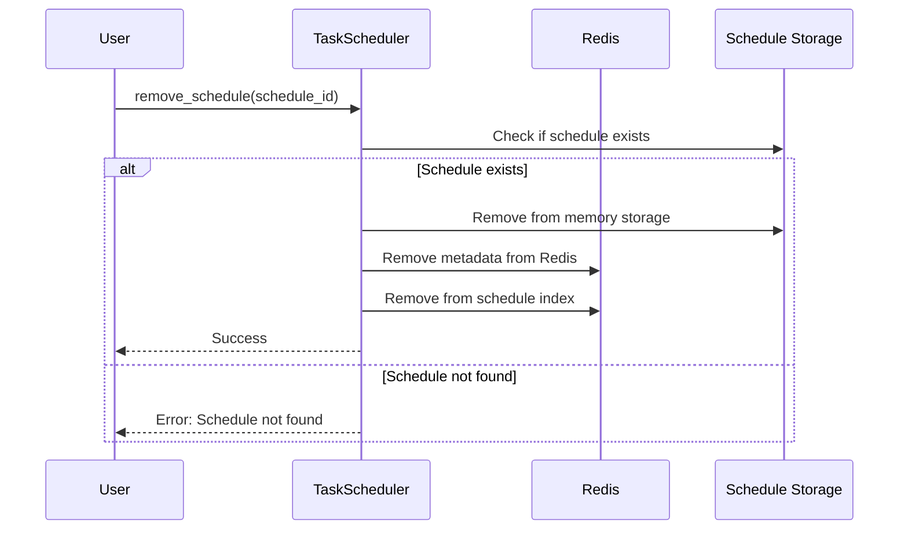
```mermaid
sequenceDiagram
    participant U as User
    participant TS as TaskScheduler
    participant R as Redis
    participant ST as Schedule Storage

    U->>TS: remove_schedule(schedule_id)
    TS->>ST: Check if schedule exists
    alt Schedule exists
        TS->>ST: Remove from memory storage
        TS->>R: Remove metadata from Redis
        TS->>R: Remove from schedule index
        TS-->>U: Success
    else Schedule not found
        TS-->>U: Error: Schedule not found
    end
```

## 3. タスク実行サイクル

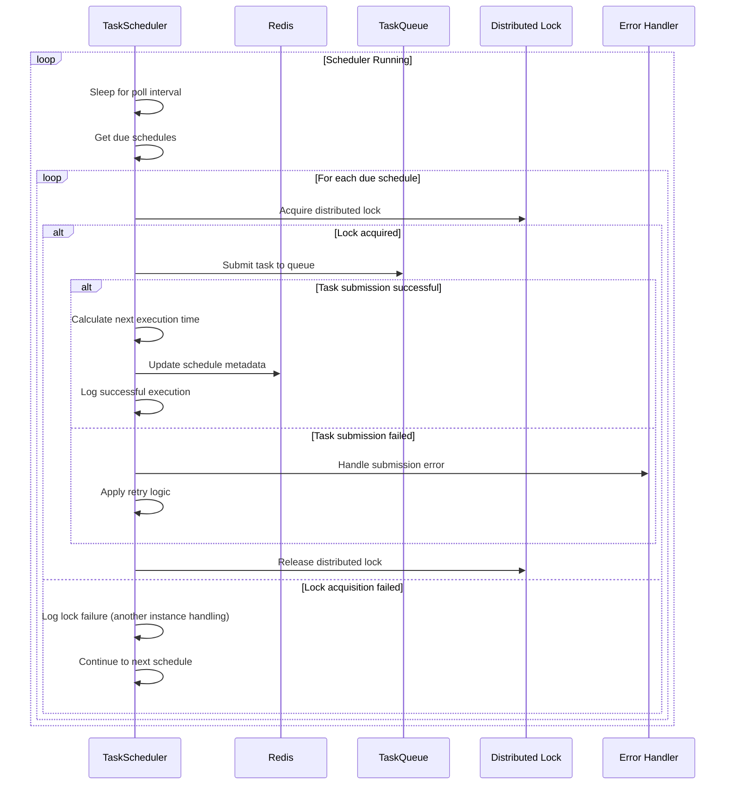
```mermaid
sequenceDiagram
    participant TS as TaskScheduler
    participant R as Redis
    participant TQ as TaskQueue
    participant DL as Distributed Lock
    participant EH as Error Handler

    loop Scheduler Running
        TS->>TS: Sleep for poll interval
        TS->>TS: Get due schedules
        
        loop For each due schedule
            TS->>DL: Acquire distributed lock
            alt Lock acquired
                TS->>TQ: Submit task to queue
                alt Task submission successful
                    TS->>TS: Calculate next execution time
                    TS->>R: Update schedule metadata
                    TS->>TS: Log successful execution
                else Task submission failed
                    TS->>EH: Handle submission error
                    TS->>TS: Apply retry logic
                end
                TS->>DL: Release distributed lock
            else Lock acquisition failed
                TS->>TS: Log lock failure (another instance handling)
                TS->>TS: Continue to next schedule
            end
        end
    end
```

### 3.1 期限到来タスクの処理

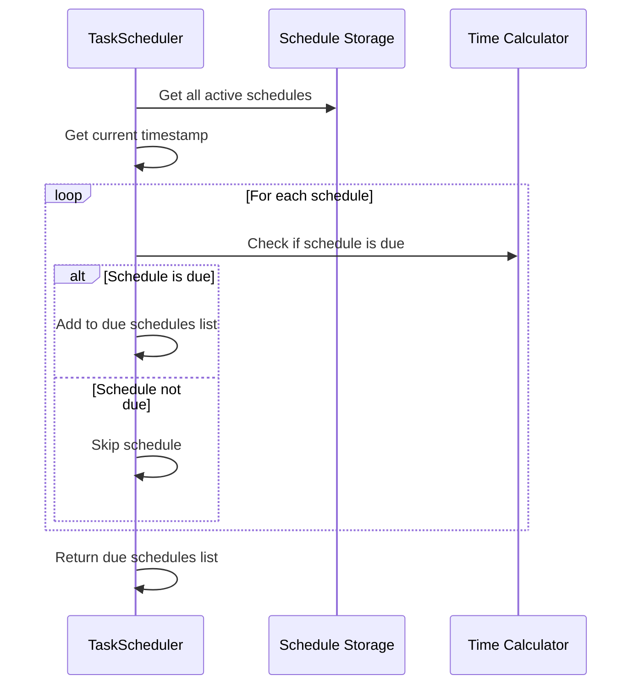
```mermaid
sequenceDiagram
    participant TS as TaskScheduler
    participant ST as Schedule Storage
    participant TC as Time Calculator

    TS->>ST: Get all active schedules
    TS->>TS: Get current timestamp
    
    loop For each schedule
        TS->>TC: Check if schedule is due
        alt Schedule is due
            TS->>TS: Add to due schedules list
        else Schedule not due
            TS->>TS: Skip schedule
        end
    end
    
    TS->>TS: Return due schedules list
```

### 3.2 分散ロック機構

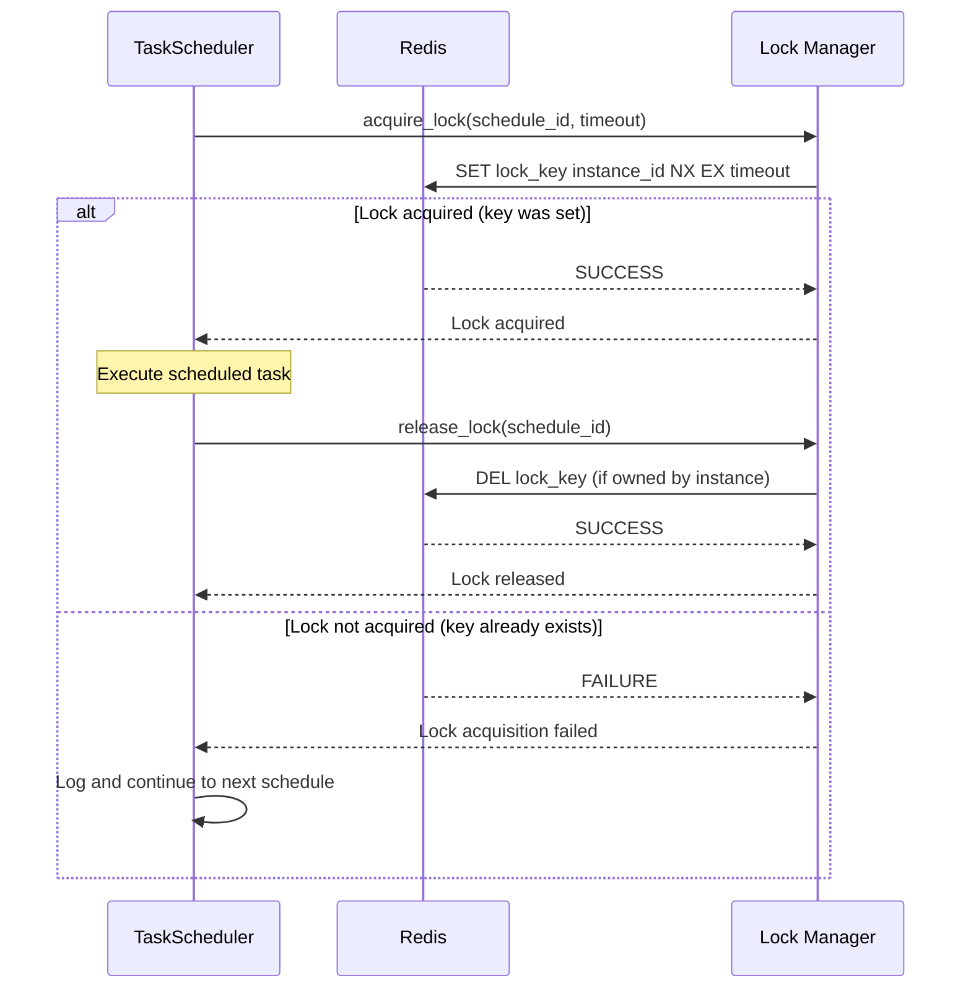
```mermaid
sequenceDiagram
    participant TS as TaskScheduler
    participant R as Redis
    participant L as Lock Manager

    TS->>L: acquire_lock(schedule_id, timeout)
    L->>R: SET lock_key instance_id NX EX timeout
    
    alt Lock acquired (key was set)
        R-->>L: SUCCESS
        L-->>TS: Lock acquired
        
        Note over TS: Execute scheduled task
        
        TS->>L: release_lock(schedule_id)
        L->>R: DEL lock_key (if owned by instance)
        R-->>L: SUCCESS
        L-->>TS: Lock released
        
    else Lock not acquired (key already exists)
        R-->>L: FAILURE
        L-->>TS: Lock acquisition failed
        TS->>TS: Log and continue to next schedule
    end
```

## 4. エラーハンドリング戦略

### 4.1 タスクキュー投入エラー

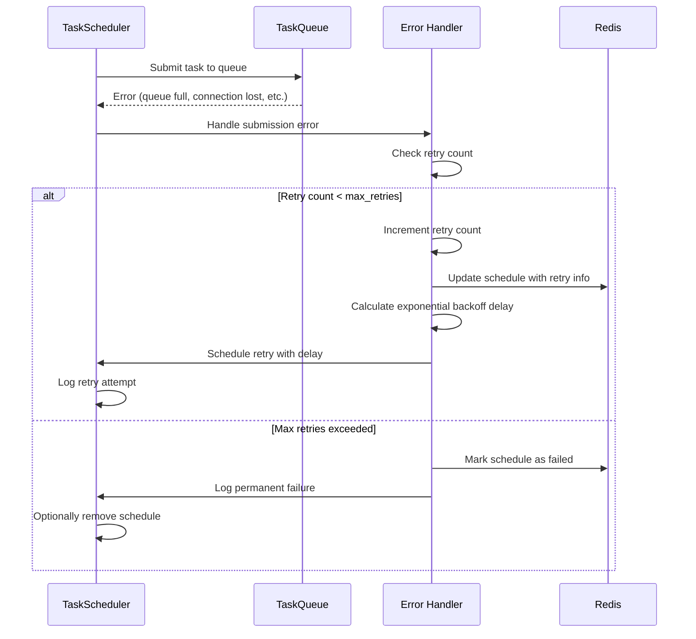
```mermaid
sequenceDiagram
    participant TS as TaskScheduler
    participant TQ as TaskQueue
    participant EH as Error Handler
    participant R as Redis

    TS->>TQ: Submit task to queue
    TQ-->>TS: Error (queue full, connection lost, etc.)
    
    TS->>EH: Handle submission error
    EH->>EH: Check retry count
    
    alt Retry count < max_retries
        EH->>EH: Increment retry count
        EH->>R: Update schedule with retry info
        EH->>EH: Calculate exponential backoff delay
        EH->>TS: Schedule retry with delay
        TS->>TS: Log retry attempt
    else Max retries exceeded
        EH->>R: Mark schedule as failed
        EH->>TS: Log permanent failure
        TS->>TS: Optionally remove schedule
    end
```

### 4.2 Redis接続エラー

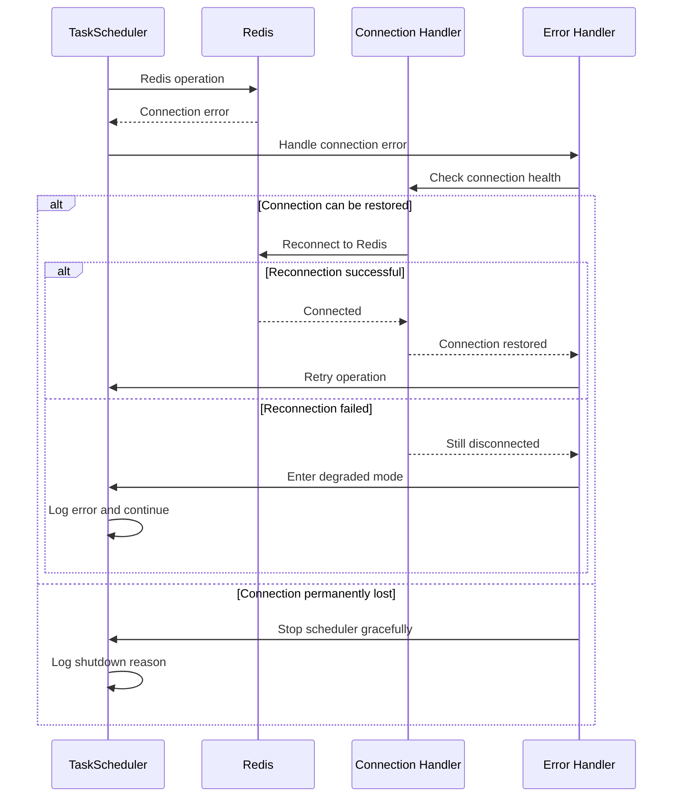
```mermaid
sequenceDiagram
    participant TS as TaskScheduler
    participant R as Redis
    participant CH as Connection Handler
    participant EH as Error Handler

    TS->>R: Redis operation
    R-->>TS: Connection error
    
    TS->>EH: Handle connection error
    EH->>CH: Check connection health
    
    alt Connection can be restored
        CH->>R: Reconnect to Redis
        alt Reconnection successful
            R-->>CH: Connected
            CH-->>EH: Connection restored
            EH->>TS: Retry operation
        else Reconnection failed
            CH-->>EH: Still disconnected
            EH->>TS: Enter degraded mode
            TS->>TS: Log error and continue
        end
    else Connection permanently lost
        EH->>TS: Stop scheduler gracefully
        TS->>TS: Log shutdown reason
    end
```

### 4.3 スケジュール設定エラー

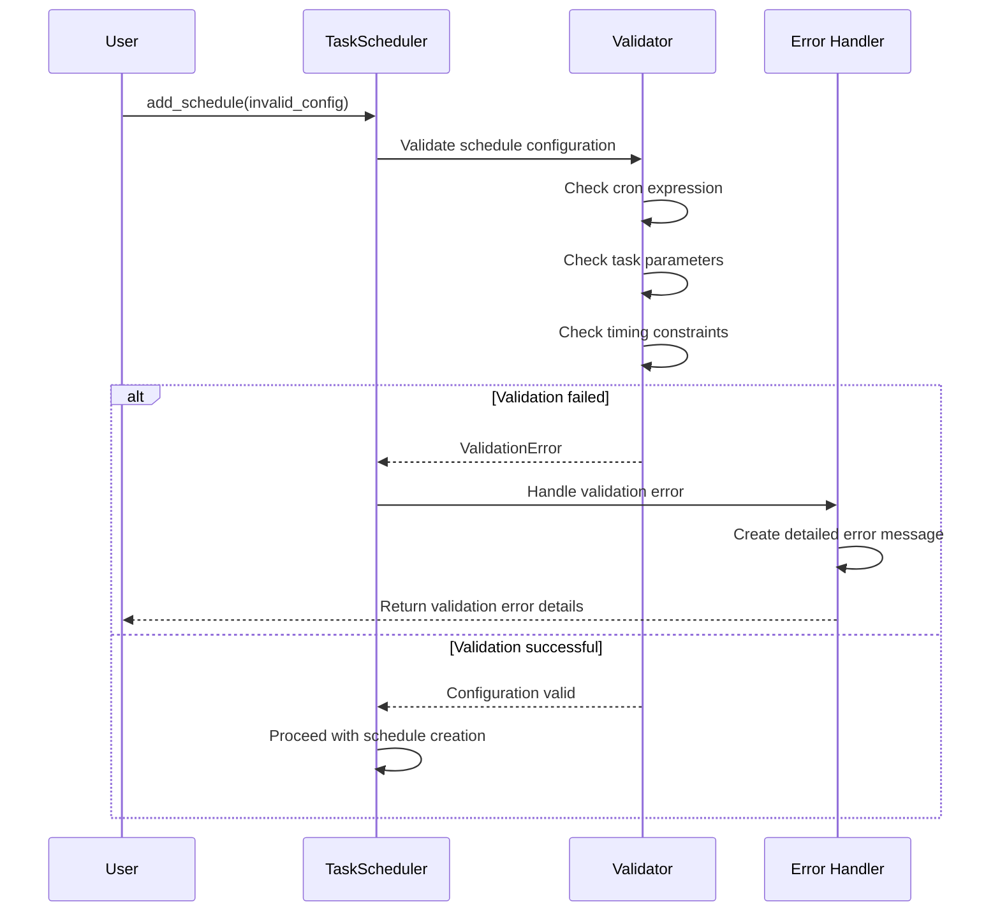
```mermaid
sequenceDiagram
    participant U as User
    participant TS as TaskScheduler
    participant V as Validator
    participant EH as Error Handler

    U->>TS: add_schedule(invalid_config)
    TS->>V: Validate schedule configuration
    V->>V: Check cron expression
    V->>V: Check task parameters
    V->>V: Check timing constraints
    
    alt Validation failed
        V-->>TS: ValidationError
        TS->>EH: Handle validation error
        EH->>EH: Create detailed error message
        EH-->>U: Return validation error details
    else Validation successful
        V-->>TS: Configuration valid
        TS->>TS: Proceed with schedule creation
    end
```

## 5. 優雅なシャットダウン

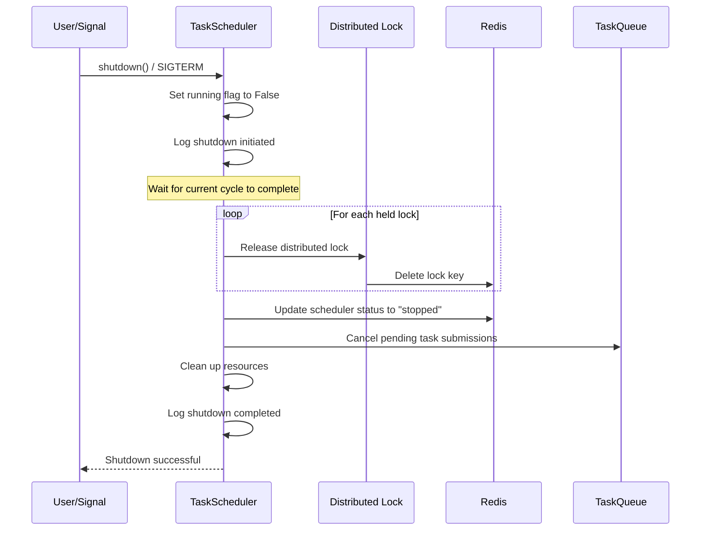
```mermaid
sequenceDiagram
    participant U as User/Signal
    participant TS as TaskScheduler
    participant DL as Distributed Lock
    participant R as Redis
    participant TQ as TaskQueue

    U->>TS: shutdown() / SIGTERM
    TS->>TS: Set running flag to False
    TS->>TS: Log shutdown initiated
    
    Note over TS: Wait for current cycle to complete
    
    loop For each held lock
        TS->>DL: Release distributed lock
        DL->>R: Delete lock key
    end
    
    TS->>R: Update scheduler status to "stopped"
    TS->>TQ: Cancel pending task submissions
    TS->>TS: Clean up resources
    TS->>TS: Log shutdown completed
    TS-->>U: Shutdown successful
```

### 5.1 進行中タスクの処理

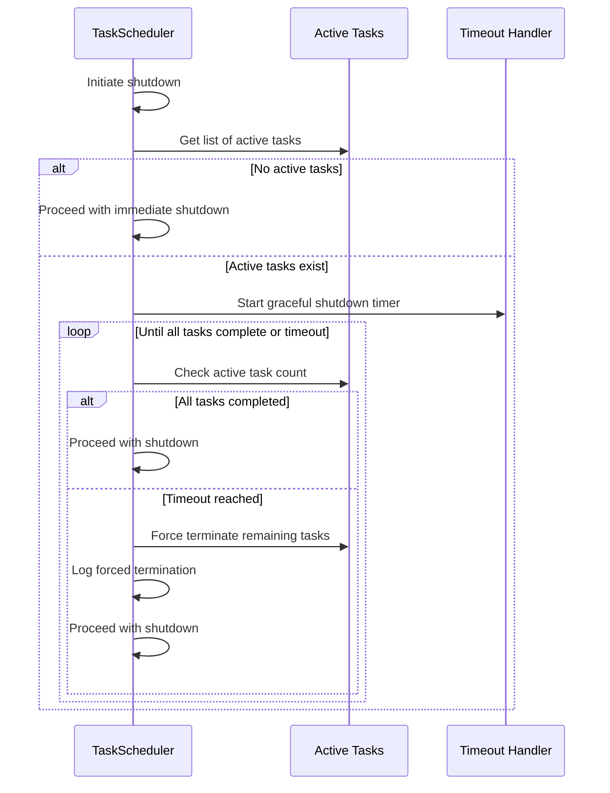
```mermaid
sequenceDiagram
    participant TS as TaskScheduler
    participant AT as Active Tasks
    participant TO as Timeout Handler

    TS->>TS: Initiate shutdown
    TS->>AT: Get list of active tasks
    
    alt No active tasks
        TS->>TS: Proceed with immediate shutdown
    else Active tasks exist
        TS->>TO: Start graceful shutdown timer
        
        loop Until all tasks complete or timeout
            TS->>AT: Check active task count
            alt All tasks completed
                TS->>TS: Proceed with shutdown
            else Timeout reached
                TS->>AT: Force terminate remaining tasks
                TS->>TS: Log forced termination
                TS->>TS: Proceed with shutdown
            end
        end
    end
```

## 6. 監視とメトリクス

### 6.1 スケジューラーヘルスチェック

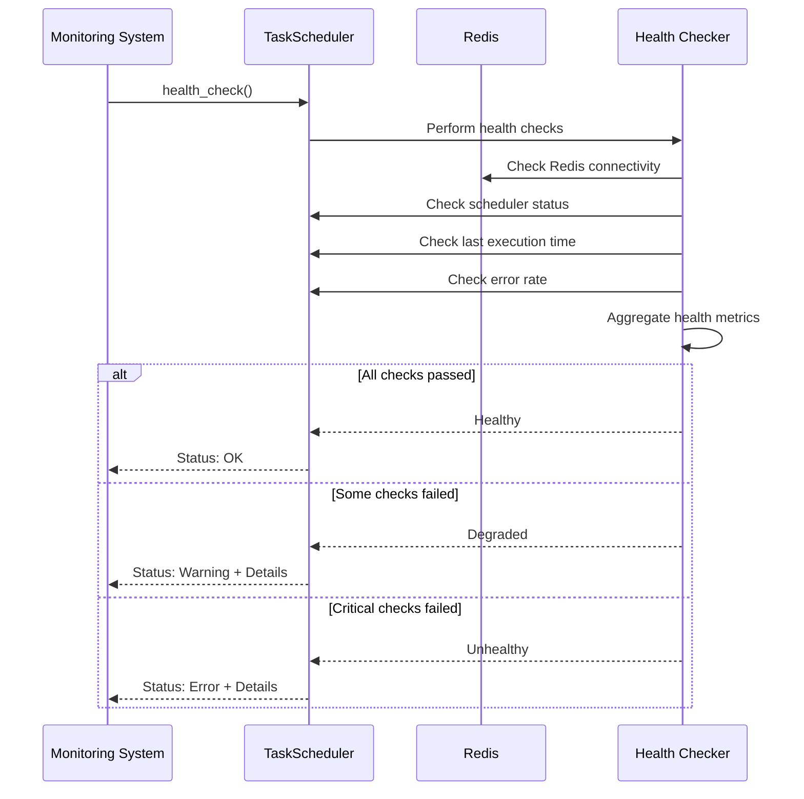
```mermaid
sequenceDiagram
    participant M as Monitoring System
    participant TS as TaskScheduler
    participant R as Redis
    participant HC as Health Checker

    M->>TS: health_check()
    TS->>HC: Perform health checks
    
    HC->>R: Check Redis connectivity
    HC->>TS: Check scheduler status
    HC->>TS: Check last execution time
    HC->>TS: Check error rate
    
    HC->>HC: Aggregate health metrics
    
    alt All checks passed
        HC-->>TS: Healthy
        TS-->>M: Status: OK
    else Some checks failed
        HC-->>TS: Degraded
        TS-->>M: Status: Warning + Details
    else Critical checks failed
        HC-->>TS: Unhealthy
        TS-->>M: Status: Error + Details
    end
```

### 6.2 パフォーマンスメトリクス

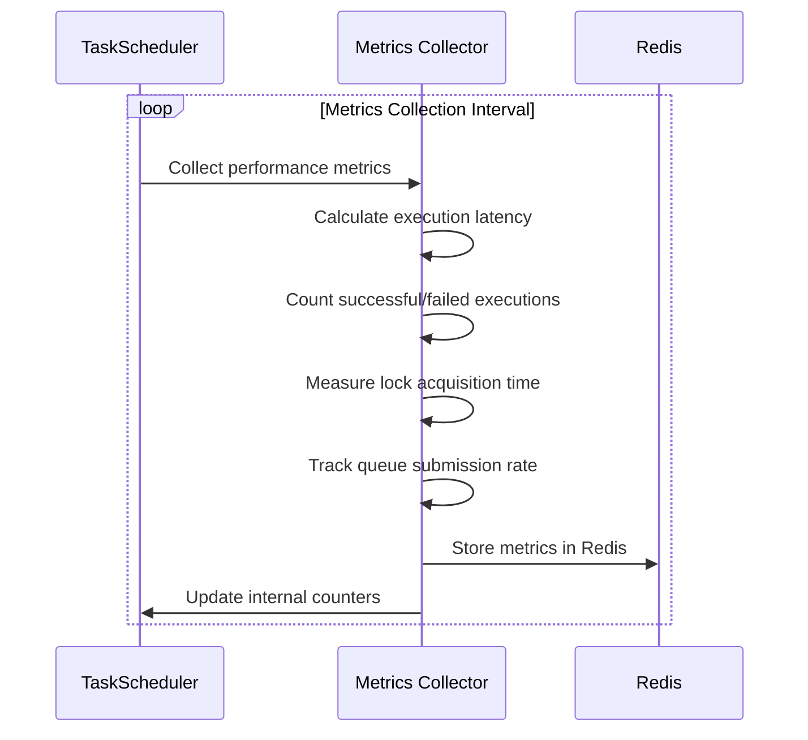
```mermaid
sequenceDiagram
    participant TS as TaskScheduler
    participant MC as Metrics Collector
    participant R as Redis

    loop Metrics Collection Interval
        TS->>MC: Collect performance metrics
        MC->>MC: Calculate execution latency
        MC->>MC: Count successful/failed executions
        MC->>MC: Measure lock acquisition time
        MC->>MC: Track queue submission rate
        
        MC->>R: Store metrics in Redis
        MC->>TS: Update internal counters
    end
```

## まとめ

TaskSchedulerは以下の主要な責任を持ちます：

1. **スケジュール管理**: タスクスケジュールの追加、更新、削除
2. **分散実行**: 分散ロックを使用した安全なタスク実行
3. **エラーハンドリング**: 堅牢なエラー処理とリトライメカニズム
4. **リソース管理**: 適切なクリーンアップと優雅なシャットダウン
5. **監視**: ヘルスチェックとパフォーマンスメトリクス

分散ロック機構により、複数のスケジューラーインスタンスが同じタスクを重複実行することを防ぎ、高可用性と一貫性を実現しています。
