# FairQueue Worker Process Sequence

## Overview

The FairQueue Worker is responsible for processing tasks from the queue with work stealing capability. It implements fair scheduling, concurrent task processing, and robust error handling to ensure reliable task execution.

## Table of Contents
1. [Worker Initialization](#worker-initialization)
2. [Main Worker Loop](#main-worker-loop)
3. [Task Processing Flow](#task-processing-flow)
4. [Work Stealing Strategy](#work-stealing-strategy)
5. [Error Handling and Recovery](#error-handling-and-recovery)
6. [Graceful Shutdown](#graceful-shutdown)
7. [Performance Monitoring](#performance-monitoring)

## Worker Initialization

The worker initialization process sets up the necessary components and validates the configuration.

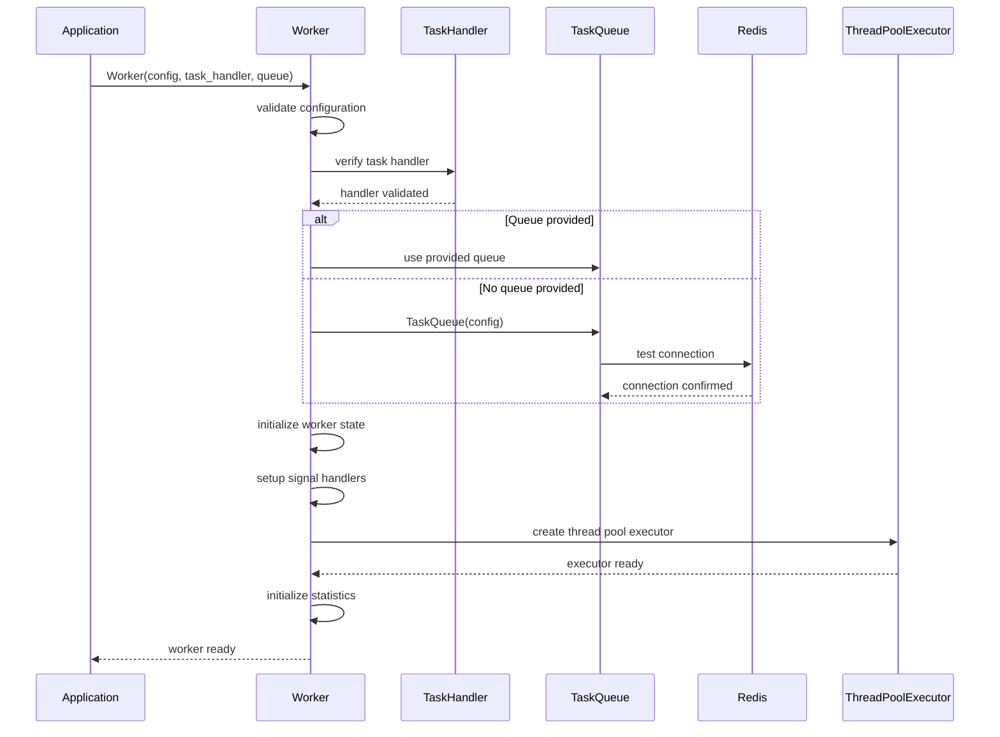

### Initialization Components

1. **Configuration Validation**: Verify worker ID, assigned users, and steal targets
2. **Task Handler Setup**: Validate the provided task handler implementation
3. **Queue Connection**: Establish or verify TaskQueue connection
4. **Thread Pool**: Create executor for concurrent task processing
5. **Signal Handlers**: Setup graceful shutdown on SIGTERM/SIGINT
6. **Statistics**: Initialize performance tracking metrics

## Main Worker Loop

The worker runs a continuous loop that polls for tasks and processes them concurrently.

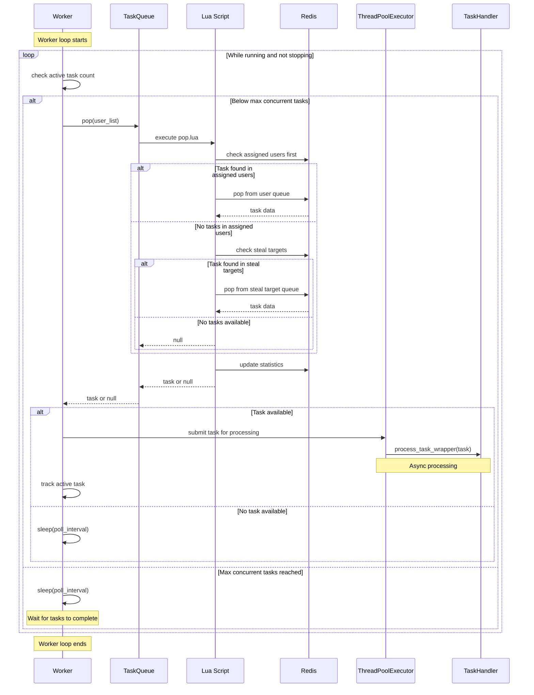

### Task Polling Strategy

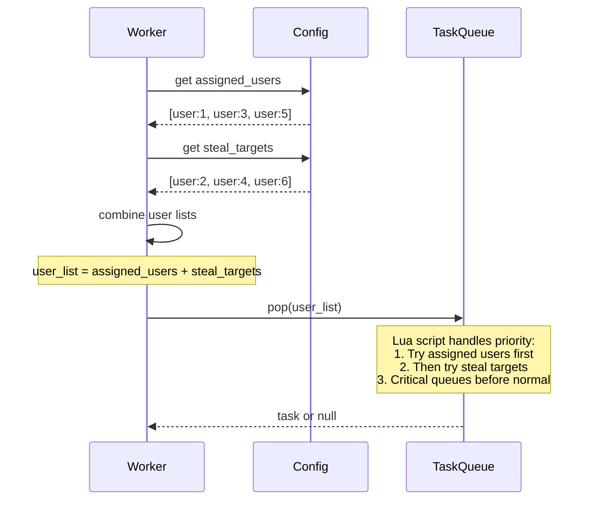

## Task Processing Flow

Each task is processed in a separate thread with timeout and error handling.

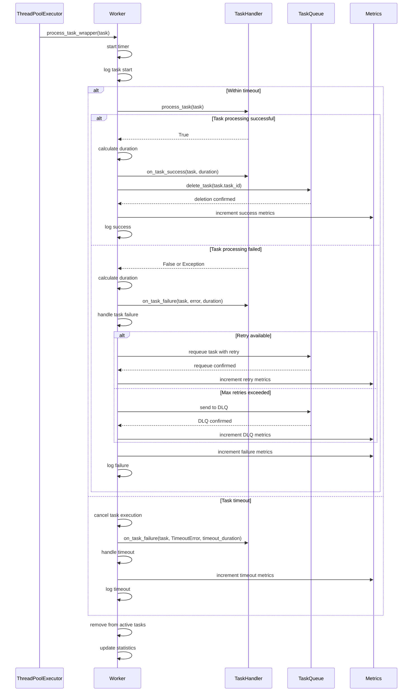

### Detailed Task Execution

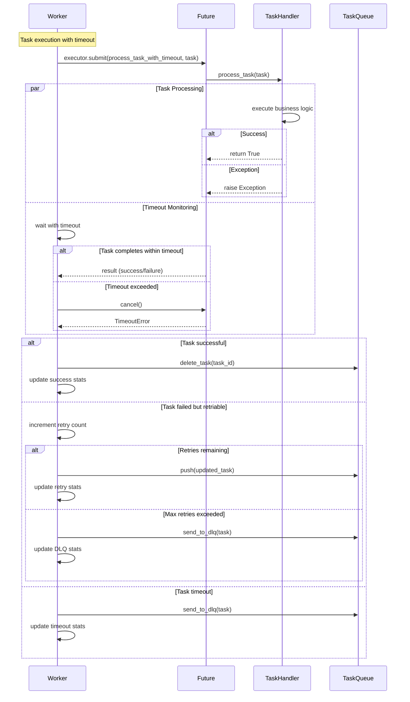

## Work Stealing Strategy

Workers implement intelligent work stealing to balance load across users.

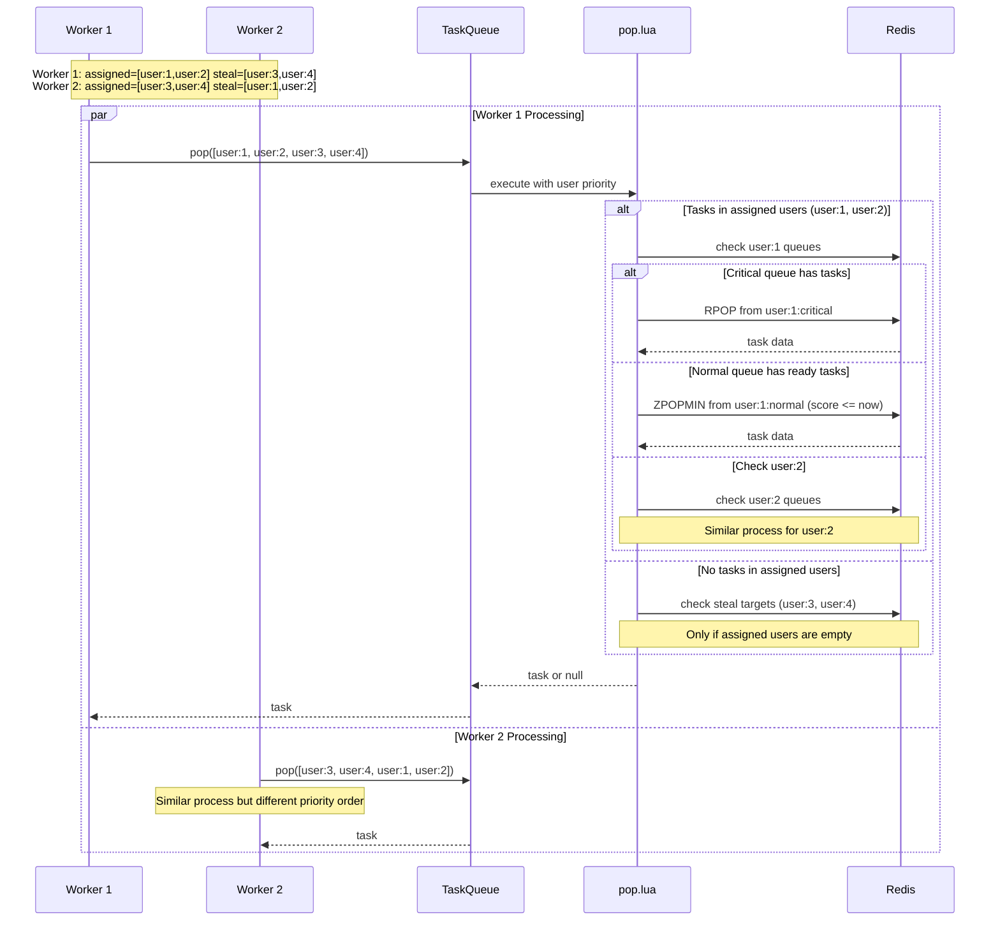

### Work Stealing Algorithm

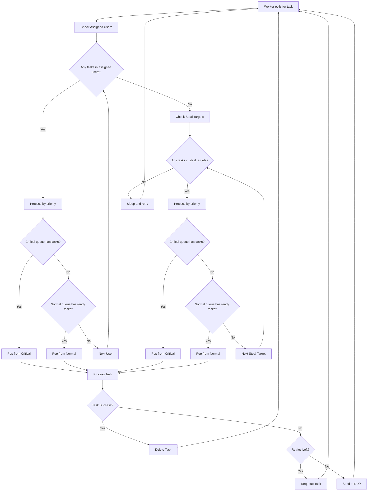

## Error Handling and Recovery

The worker implements comprehensive error handling for various failure scenarios.

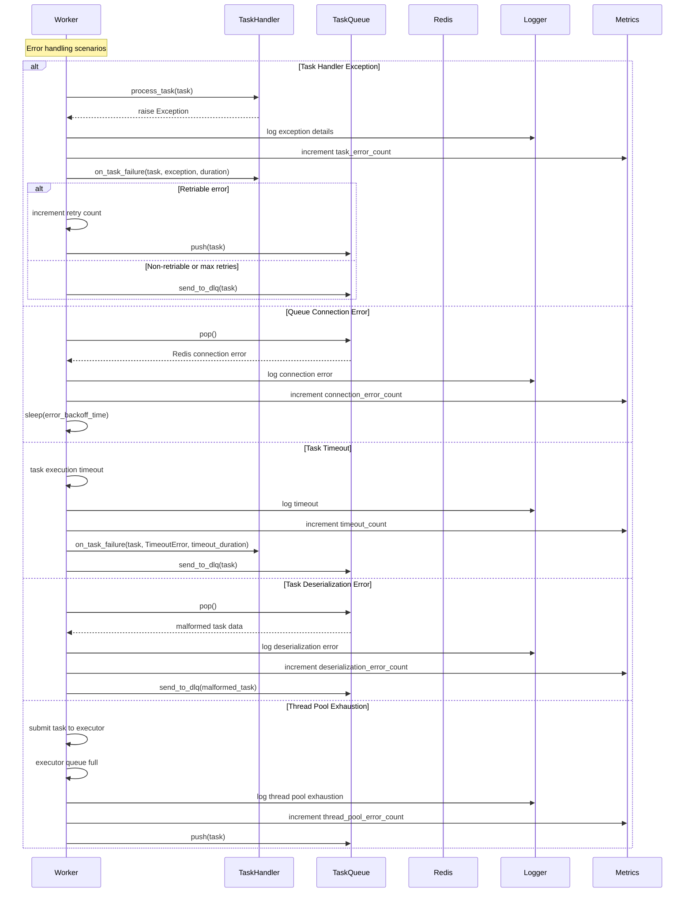

### Error Recovery Strategies

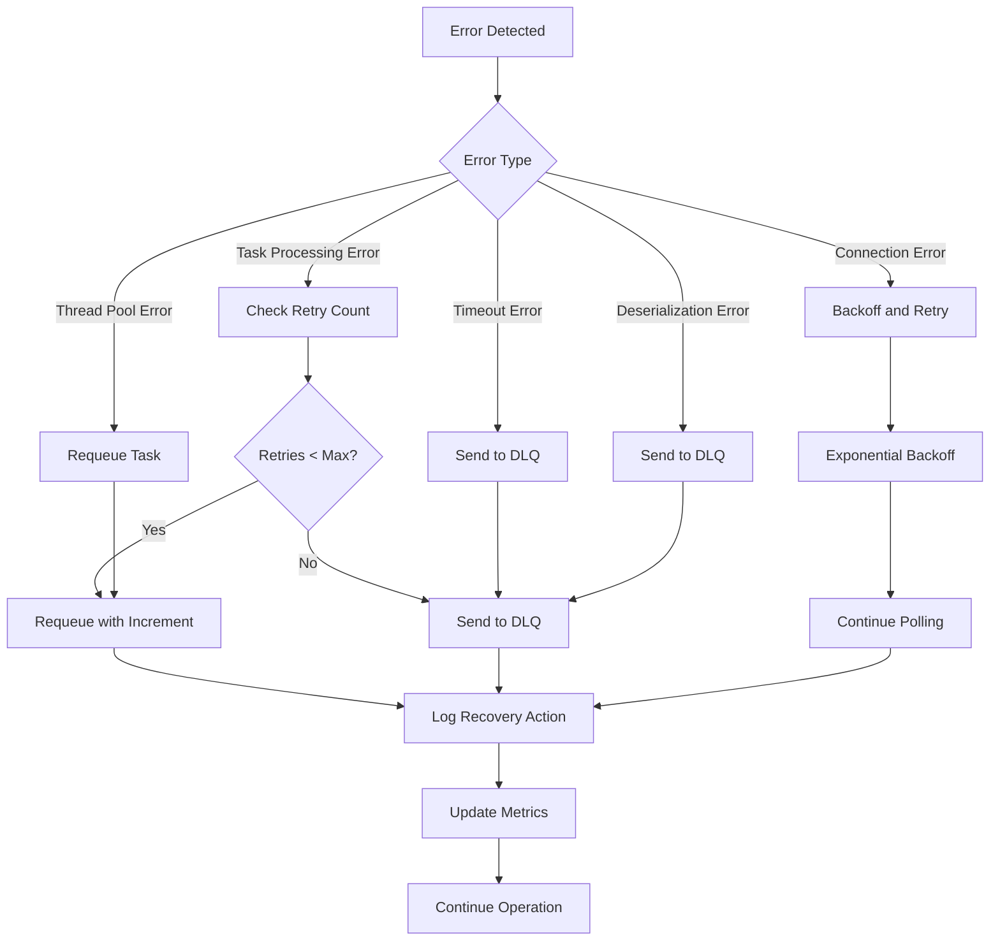

## Graceful Shutdown

The worker supports graceful shutdown to ensure running tasks complete safely.

```mermaid
sequenceDiagram
    participant A as Application
    participant W as Worker
    participant T as WorkerThread
    participant E as ThreadPoolExecutor
    participant AT as ActiveTasks
    participant Q as TaskQueue
    
    A->>W: stop(timeout)
    W->>W: set is_stopping = True
    W->>W: log shutdown initiated
    
    alt Worker thread is running
        W->>T: signal shutdown
        T->>T: finish current poll cycle
        T->>T: stop accepting new tasks
        
        W->>W: wait for active tasks
        W->>E: executor.shutdown(wait=False)
        
        loop Check active tasks
            W->>AT: get active task count
            AT-->>W: count
            
            alt Tasks still running
                W->>W: wait(check_interval)
                alt Timeout not exceeded
                    W->>W: continue waiting
                else Timeout exceeded
                    W->>E: force shutdown
                    W->>W: log forced termination
                    break
                end
            else All tasks completed
                W->>W: log graceful completion
                break
            end
        end
        
        W->>T: join thread
        T-->>W: thread finished
    end
    
    W->>Q: close connection (if owned)
    W->>W: cleanup resources
    W->>W: log shutdown complete
    W-->>A: shutdown finished
```

### Shutdown State Management

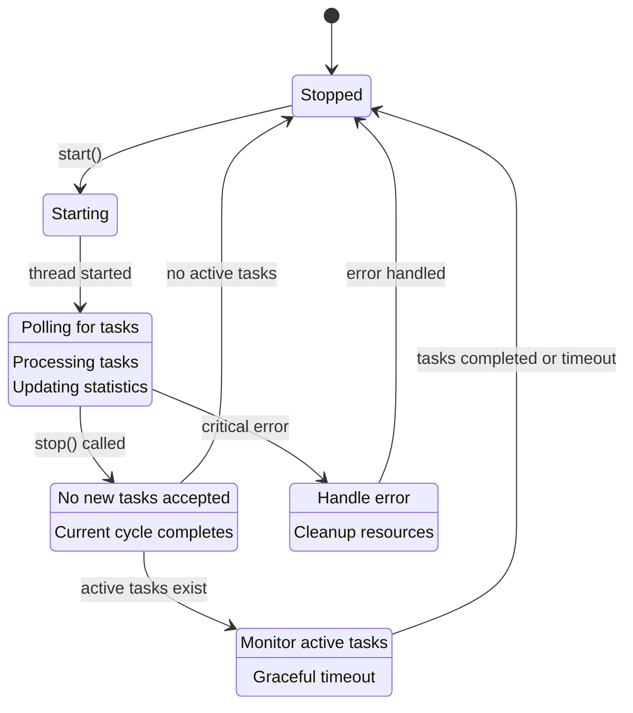

## Performance Monitoring

The worker tracks comprehensive performance metrics for monitoring and optimization.

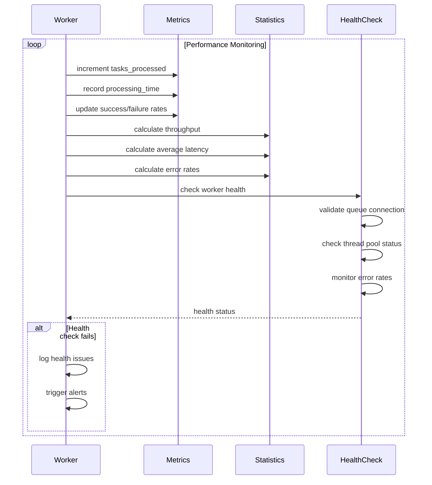

### Key Performance Metrics

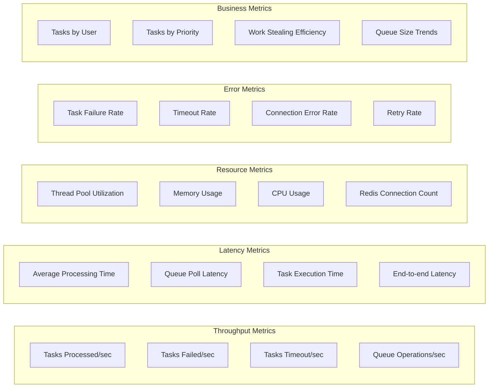

### Health Check Implementation

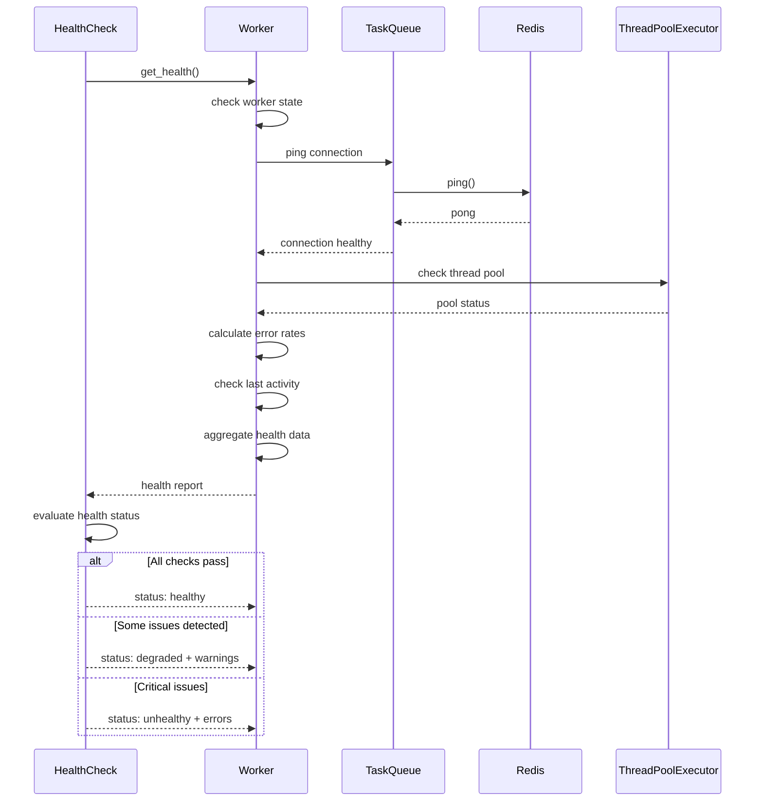

This comprehensive sequence documentation provides detailed insight into how FairQueue workers operate, from initialization through task processing to graceful shutdown, with robust error handling and performance monitoring throughout the lifecycle.
