# ワーカー処理シーケンス

このドキュメントでは、FairQueueのWorkerコンポーネントの詳細な処理シーケンスについて説明します。

## 概要

Workerは、タスクキューからタスクを取得し、実行し、結果を処理するコンポーネントです。複数のキューの優先度ベースポーリング、ワークスティーリング、包括的なエラーハンドリング、パフォーマンス監視を提供します。

## 1. ワーカー初期化

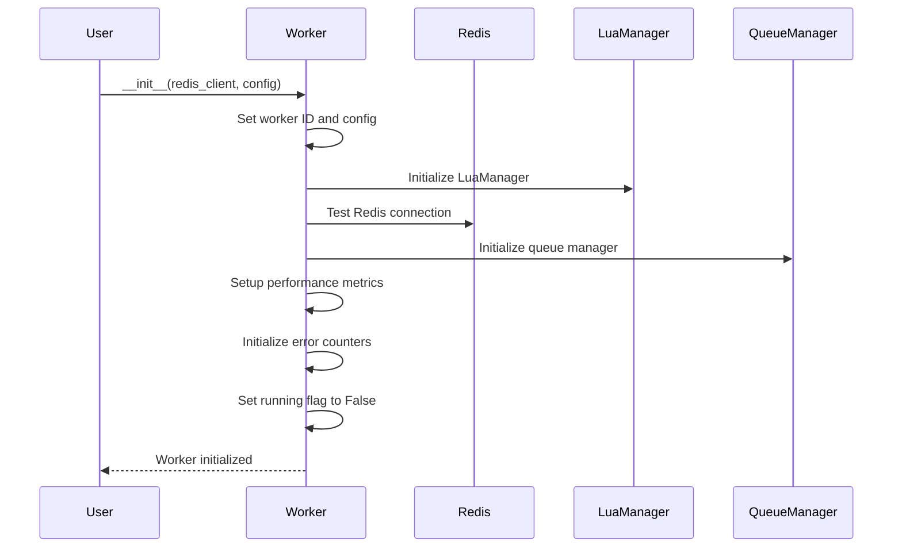
```mermaid
sequenceDiagram
    participant U as User
    participant W as Worker
    participant R as Redis
    participant LM as LuaManager
    participant QM as QueueManager

    U->>W: __init__(redis_client, config)
    W->>W: Set worker ID and config
    W->>LM: Initialize LuaManager
    W->>R: Test Redis connection
    W->>QM: Initialize queue manager
    W->>W: Setup performance metrics
    W->>W: Initialize error counters
    W->>W: Set running flag to False
    W-->>U: Worker initialized
```

### 初期化ステップ

1. **ワーカー識別**: 一意のワーカーIDを生成
2. **設定の設定**: Redisクライアントと設定パラメータを保存
3. **Luaマネージャーの初期化**: 効率的なRedis操作用のスクリプト管理を設定
4. **接続検証**: Redis接続の有効性を確認
5. **キュー管理**: キューマネージャーと優先度設定を初期化
6. **メトリクス初期化**: パフォーマンス追跡カウンターを設定
7. **状態初期化**: 実行フラグとエラーカウンターを初期化

## 2. メインポーリングループ

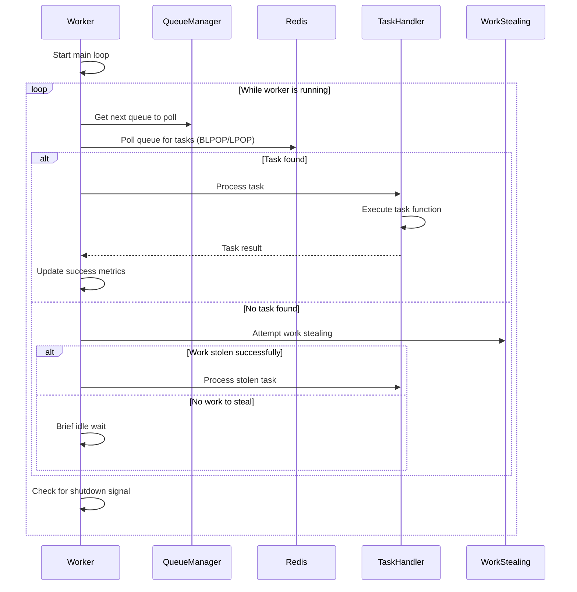
```mermaid
sequenceDiagram
    participant W as Worker
    participant QM as QueueManager
    participant R as Redis
    participant TH as TaskHandler
    participant WS as WorkStealing

    W->>W: Start main loop
    
    loop While worker is running
        W->>QM: Get next queue to poll
        W->>R: Poll queue for tasks (BLPOP/LPOP)
        
        alt Task found
            W->>TH: Process task
            TH->>TH: Execute task function
            TH-->>W: Task result
            W->>W: Update success metrics
        else No task found
            W->>WS: Attempt work stealing
            alt Work stolen successfully
                W->>TH: Process stolen task
            else No work to steal
                W->>W: Brief idle wait
            end
        end
        
        W->>W: Check for shutdown signal
    end
```

### 2.1 キュー選択戦略

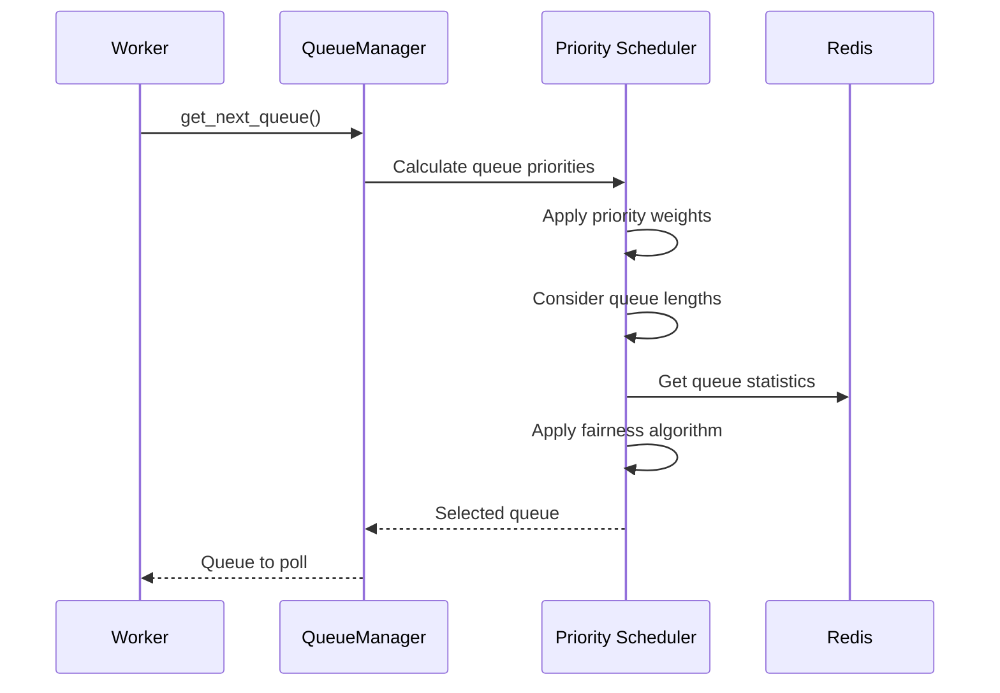
```mermaid
sequenceDiagram
    participant W as Worker
    participant QM as QueueManager
    participant PS as Priority Scheduler
    participant R as Redis

    W->>QM: get_next_queue()
    QM->>PS: Calculate queue priorities
    PS->>PS: Apply priority weights
    PS->>PS: Consider queue lengths
    PS->>R: Get queue statistics
    PS->>PS: Apply fairness algorithm
    PS-->>QM: Selected queue
    QM-->>W: Queue to poll
```

### 2.2 タスクポーリング

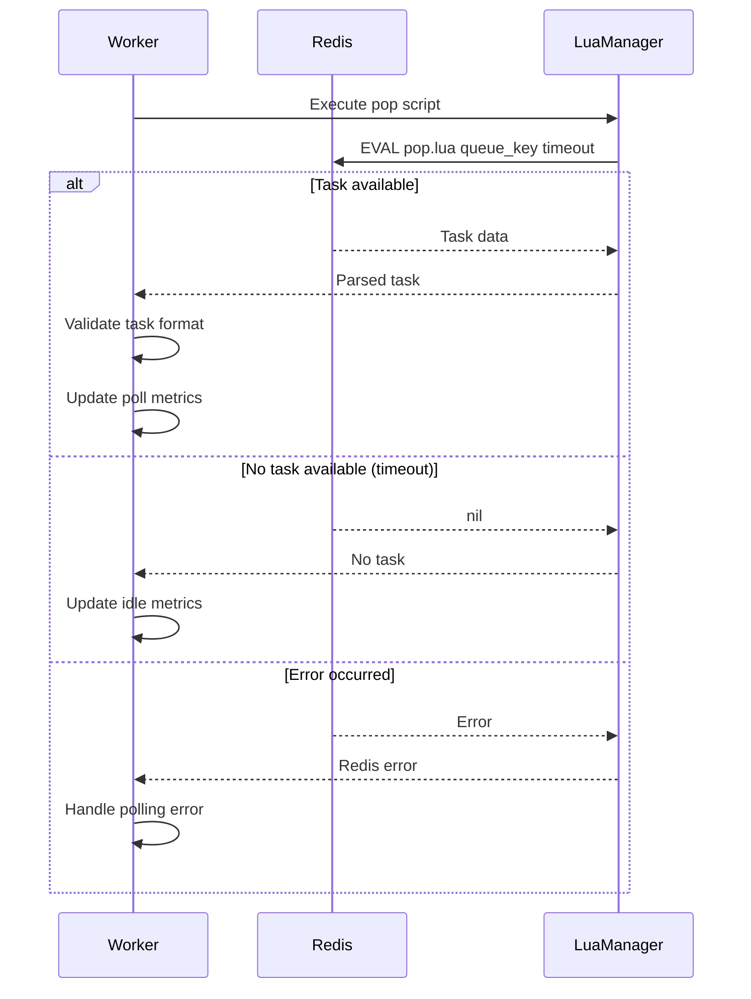
```mermaid
sequenceDiagram
    participant W as Worker
    participant R as Redis
    participant LM as LuaManager

    W->>LM: Execute pop script
    LM->>R: EVAL pop.lua queue_key timeout
    
    alt Task available
        R-->>LM: Task data
        LM-->>W: Parsed task
        W->>W: Validate task format
        W->>W: Update poll metrics
    else No task available (timeout)
        R-->>LM: nil
        LM-->>W: No task
        W->>W: Update idle metrics
    else Error occurred
        R-->>LM: Error
        LM-->>W: Redis error
        W->>W: Handle polling error
    end
```

## 3. タスク処理フロー

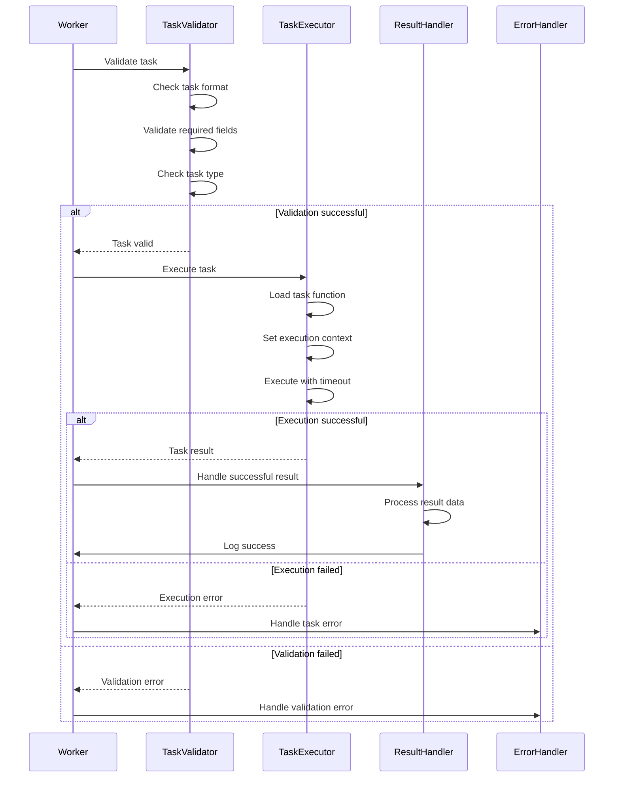
```mermaid
sequenceDiagram
    participant W as Worker
    participant TV as TaskValidator
    participant TE as TaskExecutor
    participant RH as ResultHandler
    participant EH as ErrorHandler

    W->>TV: Validate task
    TV->>TV: Check task format
    TV->>TV: Validate required fields
    TV->>TV: Check task type
    
    alt Validation successful
        TV-->>W: Task valid
        W->>TE: Execute task
        TE->>TE: Load task function
        TE->>TE: Set execution context
        TE->>TE: Execute with timeout
        
        alt Execution successful
            TE-->>W: Task result
            W->>RH: Handle successful result
            RH->>RH: Process result data
            RH->>W: Log success
        else Execution failed
            TE-->>W: Execution error
            W->>EH: Handle task error
        end
        
    else Validation failed
        TV-->>W: Validation error
        W->>EH: Handle validation error
    end
```

### 3.1 タスク実行環境

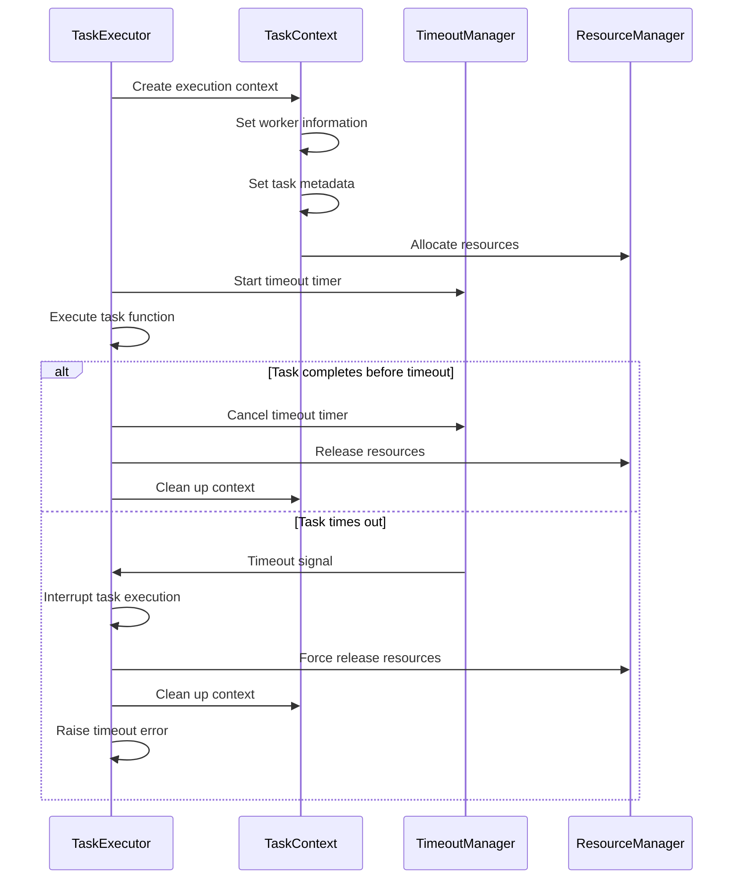
```mermaid
sequenceDiagram
    participant TE as TaskExecutor
    participant TC as TaskContext
    participant TM as TimeoutManager
    participant RM as ResourceManager

    TE->>TC: Create execution context
    TC->>TC: Set worker information
    TC->>TC: Set task metadata
    TC->>RM: Allocate resources
    
    TE->>TM: Start timeout timer
    TE->>TE: Execute task function
    
    alt Task completes before timeout
        TE->>TM: Cancel timeout timer
        TE->>RM: Release resources
        TE->>TC: Clean up context
    else Task times out
        TM->>TE: Timeout signal
        TE->>TE: Interrupt task execution
        TE->>RM: Force release resources
        TE->>TC: Clean up context
        TE->>TE: Raise timeout error
    end
```

### 3.2 結果処理

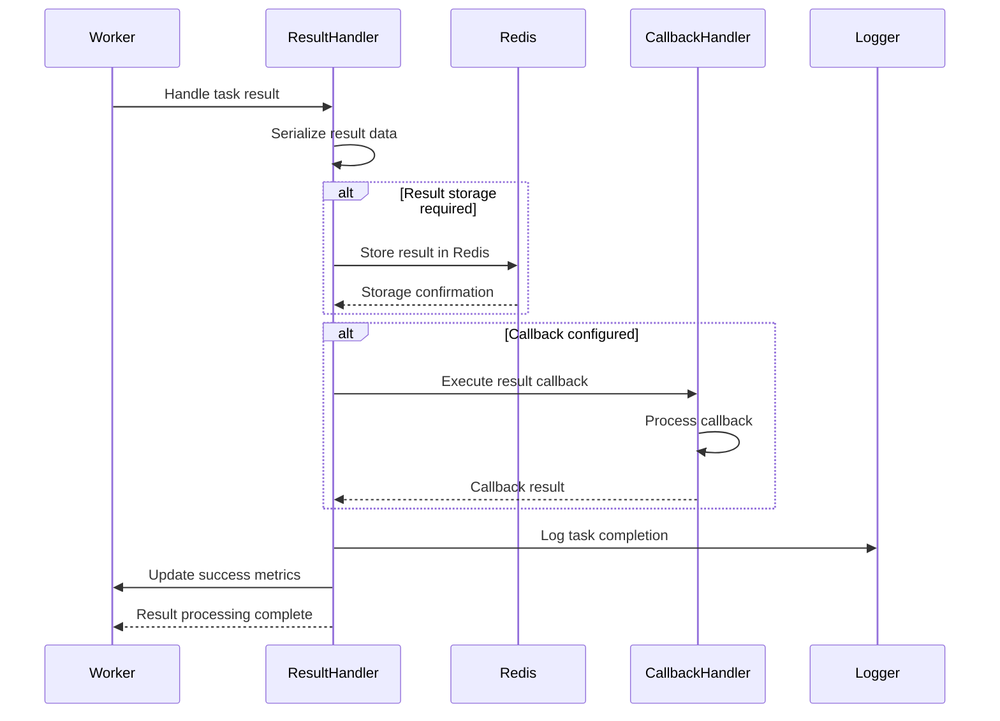
```mermaid
sequenceDiagram
    participant W as Worker
    participant RH as ResultHandler
    participant R as Redis
    participant CB as CallbackHandler
    participant L as Logger

    W->>RH: Handle task result
    RH->>RH: Serialize result data
    
    alt Result storage required
        RH->>R: Store result in Redis
        R-->>RH: Storage confirmation
    end
    
    alt Callback configured
        RH->>CB: Execute result callback
        CB->>CB: Process callback
        CB-->>RH: Callback result
    end
    
    RH->>L: Log task completion
    RH->>W: Update success metrics
    RH-->>W: Result processing complete
```

## 4. ワークスティーリングアルゴリズム

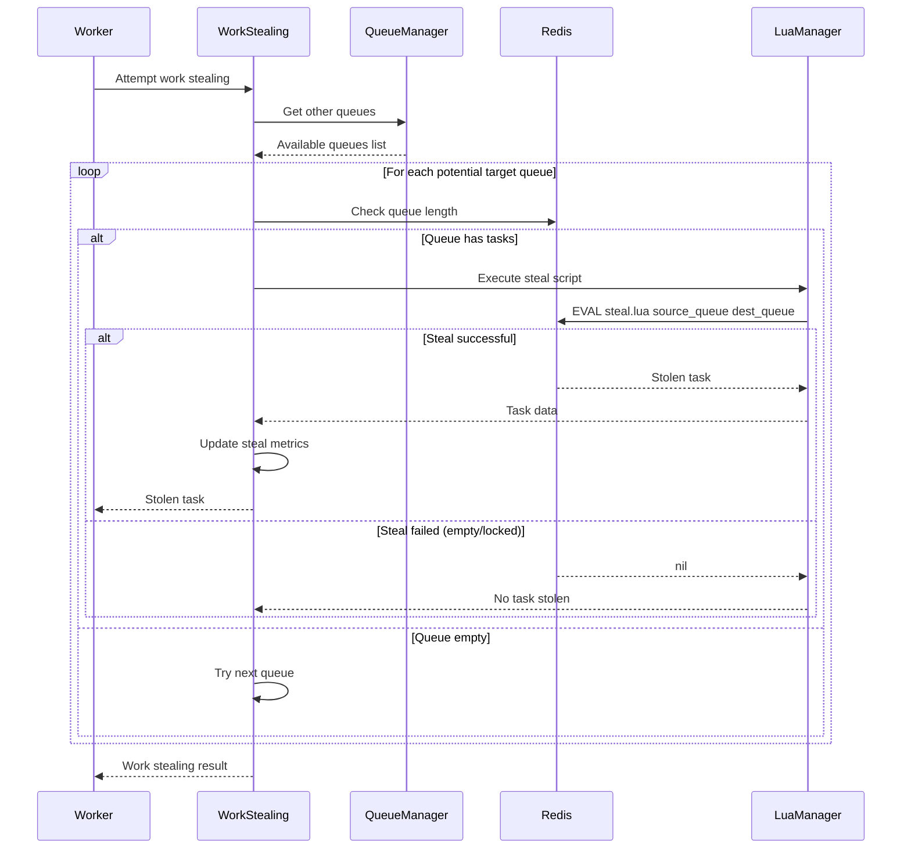
```mermaid
sequenceDiagram
    participant W as Worker
    participant WS as WorkStealing
    participant QM as QueueManager
    participant R as Redis
    participant LM as LuaManager

    W->>WS: Attempt work stealing
    WS->>QM: Get other queues
    QM-->>WS: Available queues list
    
    loop For each potential target queue
        WS->>R: Check queue length
        
        alt Queue has tasks
            WS->>LM: Execute steal script
            LM->>R: EVAL steal.lua source_queue dest_queue
            
            alt Steal successful
                R-->>LM: Stolen task
                LM-->>WS: Task data
                WS->>WS: Update steal metrics
                WS-->>W: Stolen task
            else Steal failed (empty/locked)
                R-->>LM: nil
                LM-->>WS: No task stolen
            end
        else Queue empty
            WS->>WS: Try next queue
        end
    end
    
    WS-->>W: Work stealing result
```

### 4.1 スティーリング優先度

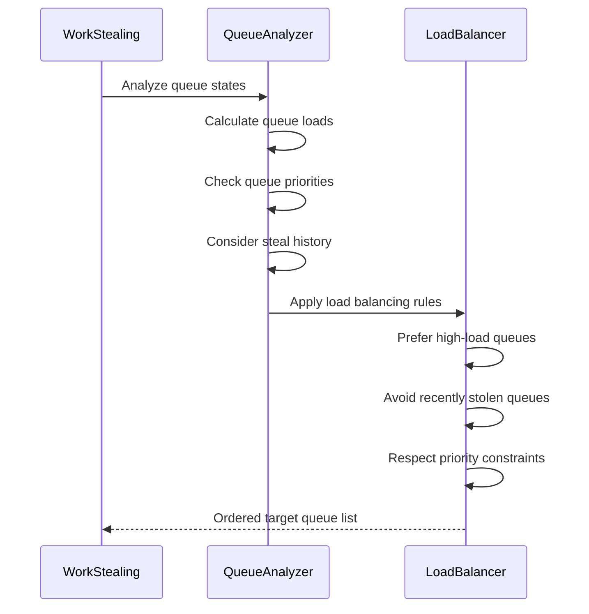
```mermaid
sequenceDiagram
    participant WS as WorkStealing
    participant QA as QueueAnalyzer
    participant LB as LoadBalancer

    WS->>QA: Analyze queue states
    QA->>QA: Calculate queue loads
    QA->>QA: Check queue priorities
    QA->>QA: Consider steal history
    
    QA->>LB: Apply load balancing rules
    LB->>LB: Prefer high-load queues
    LB->>LB: Avoid recently stolen queues
    LB->>LB: Respect priority constraints
    
    LB-->>WS: Ordered target queue list
```

## 5. 包括的エラーハンドリング

### 5.1 タスク実行エラー

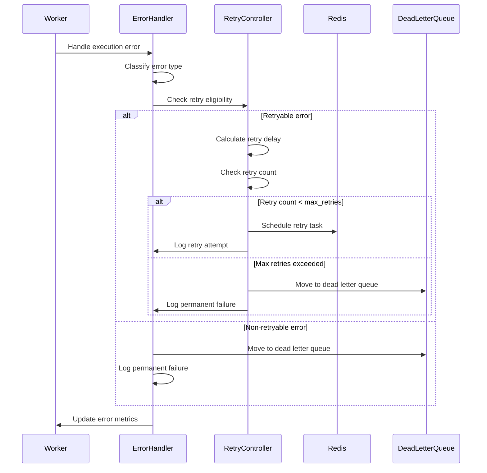
```mermaid
sequenceDiagram
    participant W as Worker
    participant EH as ErrorHandler
    participant RC as RetryController
    participant R as Redis
    participant DLQ as DeadLetterQueue

    W->>EH: Handle execution error
    EH->>EH: Classify error type
    EH->>RC: Check retry eligibility
    
    alt Retryable error
        RC->>RC: Calculate retry delay
        RC->>RC: Check retry count
        
        alt Retry count < max_retries
            RC->>R: Schedule retry task
            RC->>EH: Log retry attempt
        else Max retries exceeded
            RC->>DLQ: Move to dead letter queue
            RC->>EH: Log permanent failure
        end
        
    else Non-retryable error
        EH->>DLQ: Move to dead letter queue
        EH->>EH: Log permanent failure
    end
    
    EH->>W: Update error metrics
```

### 5.2 Redis接続エラー

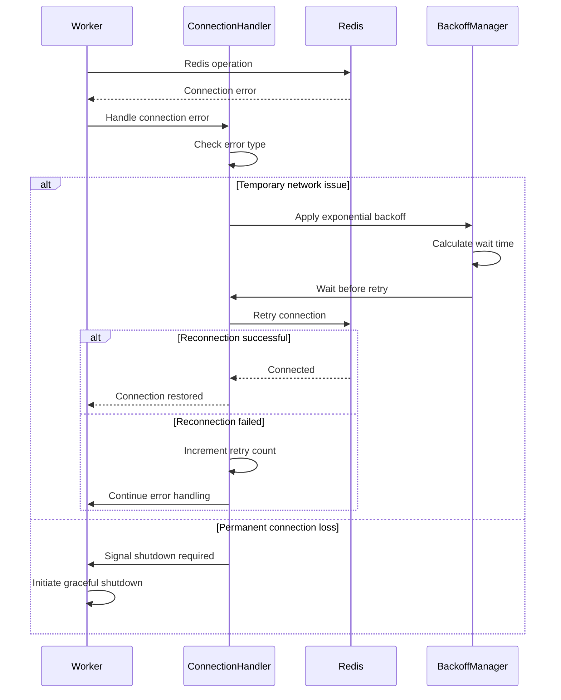
```mermaid
sequenceDiagram
    participant W as Worker
    participant CH as ConnectionHandler
    participant R as Redis
    participant BM as BackoffManager

    W->>R: Redis operation
    R-->>W: Connection error
    
    W->>CH: Handle connection error
    CH->>CH: Check error type
    
    alt Temporary network issue
        CH->>BM: Apply exponential backoff
        BM->>BM: Calculate wait time
        BM->>CH: Wait before retry
        CH->>R: Retry connection
        
        alt Reconnection successful
            R-->>CH: Connected
            CH-->>W: Connection restored
        else Reconnection failed
            CH->>CH: Increment retry count
            CH->>W: Continue error handling
        end
        
    else Permanent connection loss
        CH->>W: Signal shutdown required
        W->>W: Initiate graceful shutdown
    end
```

### 5.3 タスクフォーマットエラー

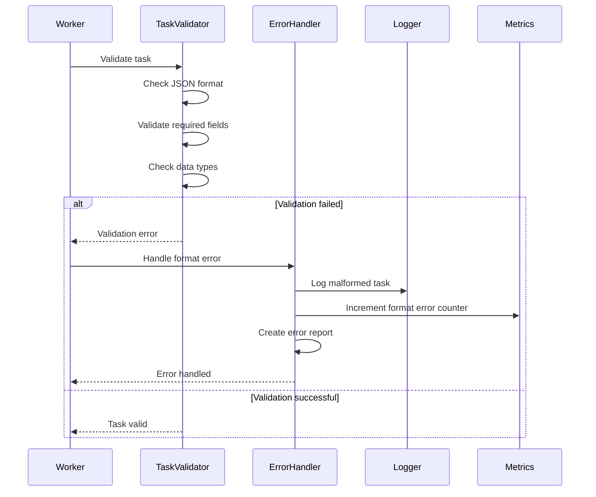
```mermaid
sequenceDiagram
    participant W as Worker
    participant TV as TaskValidator
    participant EH as ErrorHandler
    participant L as Logger
    participant M as Metrics

    W->>TV: Validate task
    TV->>TV: Check JSON format
    TV->>TV: Validate required fields
    TV->>TV: Check data types
    
    alt Validation failed
        TV-->>W: Validation error
        W->>EH: Handle format error
        EH->>L: Log malformed task
        EH->>M: Increment format error counter
        EH->>EH: Create error report
        EH-->>W: Error handled
    else Validation successful
        TV-->>W: Task valid
    end
```

## 6. 優雅なシャットダウン

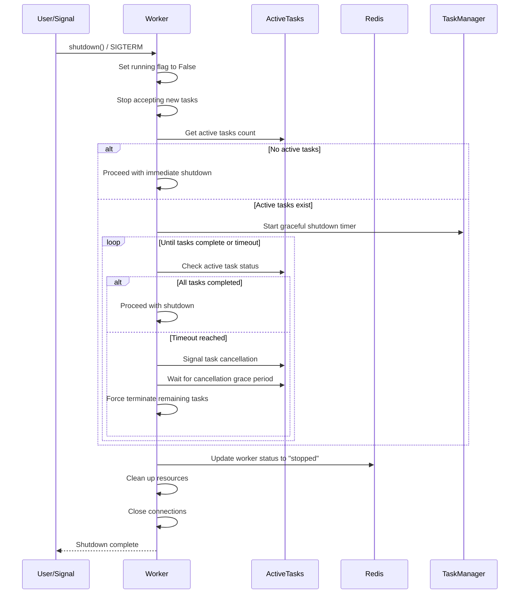
```mermaid
sequenceDiagram
    participant U as User/Signal
    participant W as Worker
    participant AT as ActiveTasks
    participant R as Redis
    participant TM as TaskManager

    U->>W: shutdown() / SIGTERM
    W->>W: Set running flag to False
    W->>W: Stop accepting new tasks
    W->>AT: Get active tasks count
    
    alt No active tasks
        W->>W: Proceed with immediate shutdown
    else Active tasks exist
        W->>TM: Start graceful shutdown timer
        
        loop Until tasks complete or timeout
            W->>AT: Check active task status
            
            alt All tasks completed
                W->>W: Proceed with shutdown
            else Timeout reached
                W->>AT: Signal task cancellation
                W->>AT: Wait for cancellation grace period
                W->>W: Force terminate remaining tasks
            end
        end
    end
    
    W->>R: Update worker status to "stopped"
    W->>W: Clean up resources
    W->>W: Close connections
    W-->>U: Shutdown complete
```

### 6.1 進行中タスクの処理

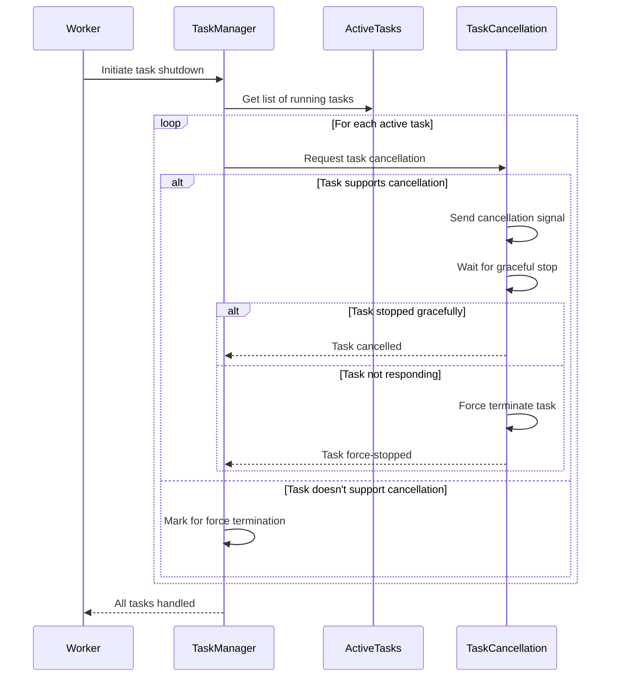
```mermaid
sequenceDiagram
    participant W as Worker
    participant TM as TaskManager
    participant AT as ActiveTasks
    participant TC as TaskCancellation

    W->>TM: Initiate task shutdown
    TM->>AT: Get list of running tasks
    
    loop For each active task
        TM->>TC: Request task cancellation
        
        alt Task supports cancellation
            TC->>TC: Send cancellation signal
            TC->>TC: Wait for graceful stop
            
            alt Task stopped gracefully
                TC-->>TM: Task cancelled
            else Task not responding
                TC->>TC: Force terminate task
                TC-->>TM: Task force-stopped
            end
            
        else Task doesn't support cancellation
            TM->>TM: Mark for force termination
        end
    end
    
    TM-->>W: All tasks handled
```

## 7. パフォーマンス監視

### 7.1 メトリクス収集

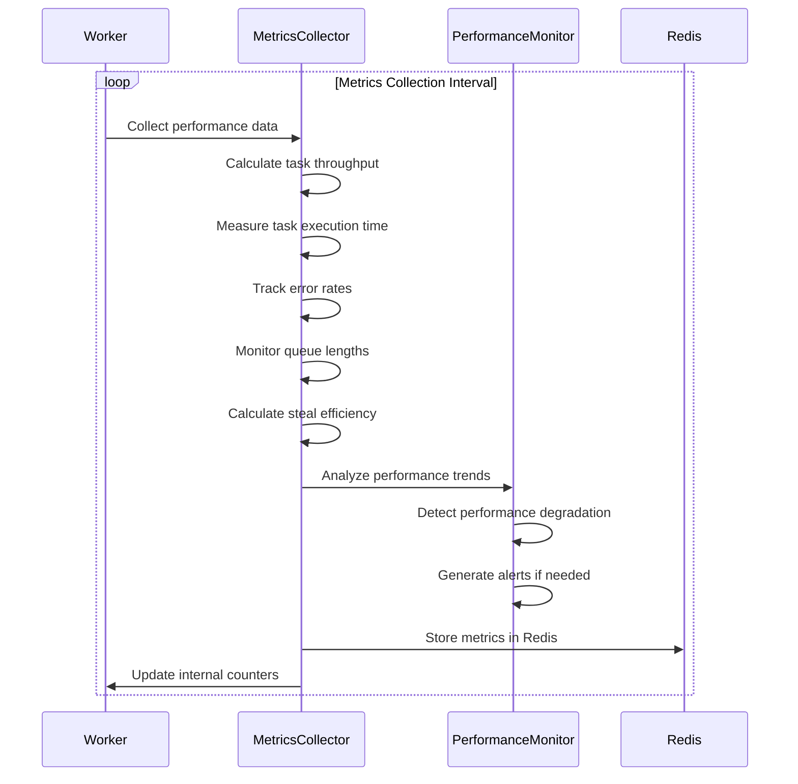
```mermaid
sequenceDiagram
    participant W as Worker
    participant MC as MetricsCollector
    participant PM as PerformanceMonitor
    participant R as Redis

    loop Metrics Collection Interval
        W->>MC: Collect performance data
        MC->>MC: Calculate task throughput
        MC->>MC: Measure task execution time
        MC->>MC: Track error rates
        MC->>MC: Monitor queue lengths
        MC->>MC: Calculate steal efficiency
        
        MC->>PM: Analyze performance trends
        PM->>PM: Detect performance degradation
        PM->>PM: Generate alerts if needed
        
        MC->>R: Store metrics in Redis
        MC->>W: Update internal counters
    end
```

### 7.2 ヘルスチェック

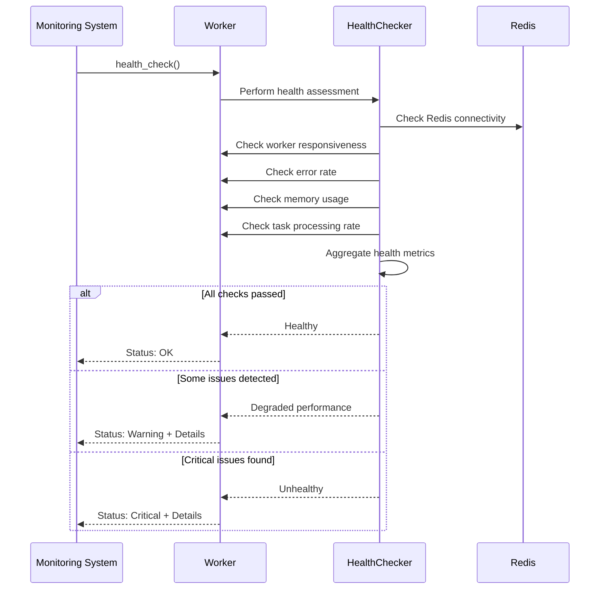
```mermaid
sequenceDiagram
    participant M as Monitoring System
    participant W as Worker
    participant HC as HealthChecker
    participant R as Redis

    M->>W: health_check()
    W->>HC: Perform health assessment
    
    HC->>R: Check Redis connectivity
    HC->>W: Check worker responsiveness
    HC->>W: Check error rate
    HC->>W: Check memory usage
    HC->>W: Check task processing rate
    
    HC->>HC: Aggregate health metrics
    
    alt All checks passed
        HC-->>W: Healthy
        W-->>M: Status: OK
    else Some issues detected
        HC-->>W: Degraded performance
        W-->>M: Status: Warning + Details
    else Critical issues found
        HC-->>W: Unhealthy
        W-->>M: Status: Critical + Details
    end
```

### 7.3 アダプティブ設定

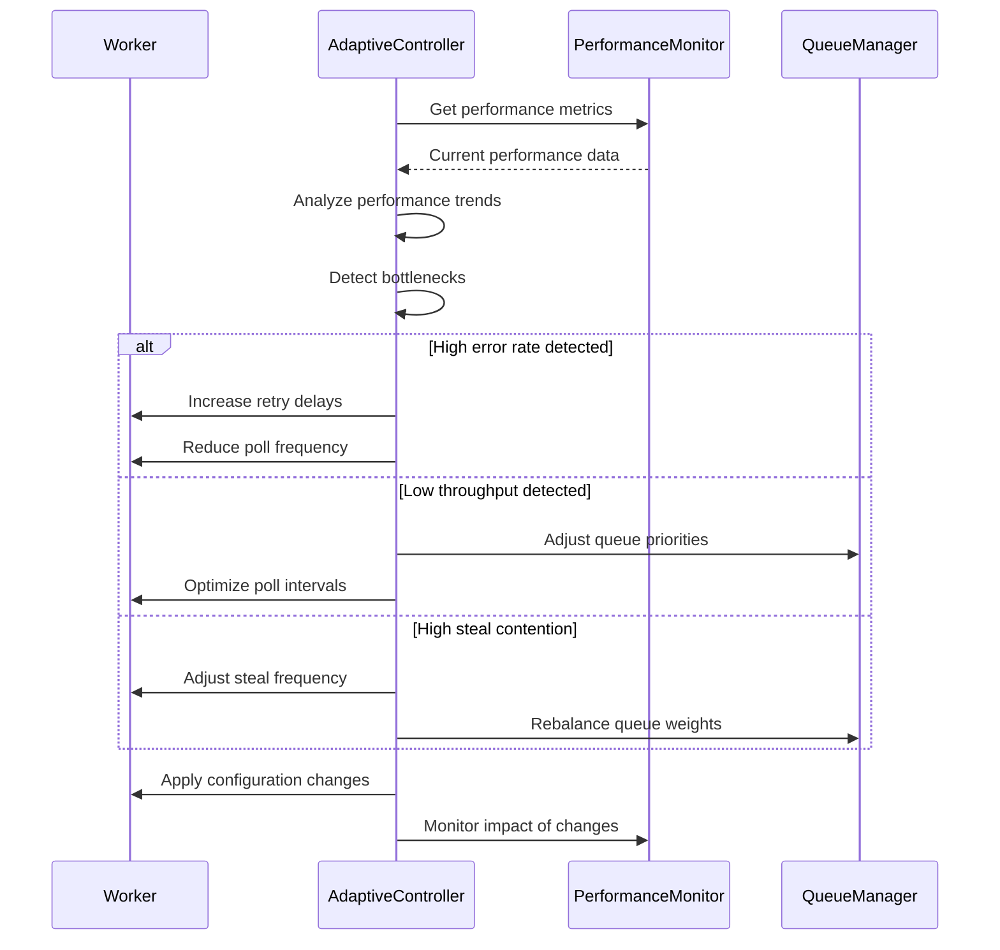
```mermaid
sequenceDiagram
    participant W as Worker
    participant AC as AdaptiveController
    participant PM as PerformanceMonitor
    participant QM as QueueManager

    AC->>PM: Get performance metrics
    PM-->>AC: Current performance data
    
    AC->>AC: Analyze performance trends
    AC->>AC: Detect bottlenecks
    
    alt High error rate detected
        AC->>W: Increase retry delays
        AC->>W: Reduce poll frequency
    else Low throughput detected
        AC->>QM: Adjust queue priorities
        AC->>W: Optimize poll intervals
    else High steal contention
        AC->>W: Adjust steal frequency
        AC->>QM: Rebalance queue weights
    end
    
    AC->>W: Apply configuration changes
    AC->>PM: Monitor impact of changes
```

## まとめ

Workerコンポーネントは以下の主要な責任を持ちます：

1. **タスク取得**: 優先度ベースの効率的なキューポーリング
2. **タスク実行**: 安全で監視されたタスク実行環境
3. **ワークスティーリング**: 動的負荷分散のための効率的な作業再分散
4. **エラーハンドリング**: 包括的なエラー処理とリカバリー機構
5. **パフォーマンス監視**: 継続的な性能追跡と適応的最適化
6. **優雅な終了**: クリーンなシャットダウンとリソース管理

ワーカーの設計は、高いスループット、堅牢性、スケーラビリティを提供し、分散環境での効率的なタスク処理を実現します。
